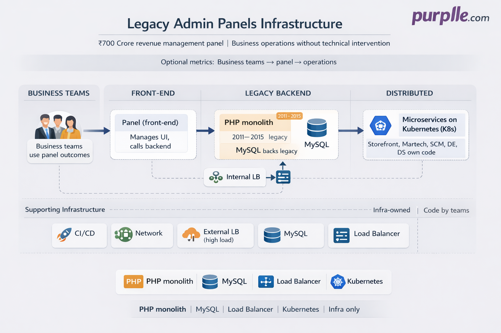

# Legacy Admin Panels Infrastructure | Purplle.com

## Project Overview

**Company:** Purplle.com  
**Project Type:** Production Platform - Legacy Backend Admin Panels (Infrastructure only)  
**Status:** Live & Operational  
**Duration:** Jan 2023 - Feb 2026  
**Platform:** Managed system whose outcomes business teams use to deliver changes: front banner, newer campaigns, Martech campaigns, logistic changes. Legacy PHP monolith (backend admin panels) maintained from the front-end side; front-end manages the panel and calls the backend. Backend connects to distributed (microservice) architecture via internal load balancer. Application code is owned by other teams (Storefront, Martech, SCM, Data Engineering, Data Science); business teams use the panel to run operations.  
**Deployment:** Monolith deployment, load balancer (high load), MySQL database and connections; internal load balancer between legacy instance and distributed K8s-based services.  
**Role:** DevOps / Infrastructure Engineer — part of team that managed CI/CD, network, monolith deployment, load balancer under high load, MySQL backing the architecture, and internal load balancer to distributed architecture. Did not own application code.  
**Note:** Code owned and maintained by Storefront, Martech, Supply Chain Management, Data Engineering, Data Science teams. Infra owned: CI/CD, network, monolith deployment, load balancer, MySQL, internal load balancer to distributed architecture.

## Executive Summary

The **legacy backend admin panels** at Purplle.com power the system whose outcomes **business teams** use to push changes into production: front banner, newer campaigns, Martech campaigns, and logistic changes. Other teams (Storefront, Martech, SCM, Data Engineering, Data Science) own and maintain the code; business teams use the panel to run operations. The **monolith** was written in **PHP** (2011 to 2015). Code updates were largely paused around 2015; very few updates have been done since then till present. It is now maintained **from the front-end side only**: the front-end manages the panel and calls the backend. Purplle has done **micro-service modernization**; the backend is supported by a **distributed architecture** — microservices deployed on **Kubernetes** with many infrastructure components. The **legacy instance** talks to this distributed architecture through an **internal load balancer**, which is managed by the DevOps team.

**What I managed (summary of facts):**
- **CI/CD** — Pipelines and deployment for the monolith and related infra.
- **Network** — Connectivity and network for the admin panels and legacy-to-distributed path.
- **Monolith deployment** — Deploying and operating the legacy backend admin panels.
- **Load balancer** — Under high load; managed by DevOps.
- **MySQL database** — Backing the legacy architecture; connections managed by infra.
- **Internal load balancer** — Between legacy instance and distributed (K8s) architecture; managed by DevOps.
- **Code** — Not owned by infra; Storefront, Martech, SCM, Data Engineering, Data Science own and maintain the code.

## Business Impact

### ₹700 Crore revenue management panel — business operations without technical intervention
- **Backbone of the ₹700 Crore revenue management panel** — **Business teams use the legacy panel outcomes** to run business operations seamlessly **without the intervention of technical teams**. Other teams own the code that powers the panel; business teams go to the panel, click a few buttons, and it happens (front banner, campaigns, Martech, logistics).

## Business Objectives

**Primary Goal:** Maintain infrastructure for the legacy backend admin panels so business teams can deliver changes (front banner, campaigns, Martech, logistics) reliably; legacy and distributed architecture work together via internal load balancer.

**Business Requirements:**
- **Business teams** use the managed system to reflect changes: front banner, newer campaigns, Martech campaigns, logistic changes.
- **Legacy monolith** (PHP) maintained from front-end side; front-end calls backend; backend calls distributed architecture via internal load balancer.
- **Infra ownership:** CI/CD, network, monolith deployment, load balancer (high load), MySQL, internal load balancer. **Code ownership:** Storefront, Martech, SCM, Data Engineering, Data Science.
- **High availability:** Load balancer under high load; MySQL and connections; reliable path legacy → internal LB → distributed K8s.

**Business Drivers:**
- Business teams need a stable system to deliver campaigns, banners, and logistic changes; infra must keep legacy and distributed path running and secure.
- Clear split: application code by product/engineering teams; infra by DevOps (deployment, load balancer, DB, network).

## Business Metrics

### Scale & Deployment
- **Infra maintained:** CI/CD, network, monolith deployment, load balancer (high load), MySQL backing legacy architecture, internal load balancer (legacy → distributed K8s).
- **Flow:** Business teams → front-end (panel) → backend (legacy PHP monolith) → internal load balancer → distributed microservices (K8s). MySQL backs the legacy side.
- **Ownership:** Infra—CI/CD, network, monolith deployment, load balancer, MySQL, internal load balancer; Storefront, Martech, SCM, Data Engineering, Data Science—application code.

### Key Achievements
- ✅ **Infra for legacy admin panels** — CI/CD, network, monolith deployment, load balancer, MySQL, internal load balancer so business teams can deliver changes.
- ✅ **Load balancer under high load** — Managed by DevOps for availability.
- ✅ **Legacy–distributed path** — Internal load balancer between legacy instance and K8s-based distributed architecture; managed by DevOps.
- ✅ **MySQL and connections** — Database backing the legacy architecture; connections managed by infra.
- ✅ **Micro-service modernization support** — Infra supports the hybrid legacy + distributed setup.

## Technical Stack (Infrastructure side)

**Legacy:** PHP monolith (2011 to 2015); code updates largely paused around 2015, very few updates since then till present; maintained from front-end side; front-end calls backend.  
**Load balancing:** External load balancer (high load); internal load balancer (legacy → distributed K8s).  
**Database:** MySQL backing legacy architecture; connections managed by infra.  
**Distributed:** Microservices on Kubernetes (code owned by Storefront, Martech, SCM, Data Engineering, Data Science).  
**CI/CD & network:** Pipelines, deployment, network—DevOps owned.

## Architecture Overview

*Business teams use the panel (front-end) to deliver changes; front-end calls legacy backend (PHP monolith). Legacy talks to distributed architecture via internal load balancer. Infra: CI/CD, network, monolith deployment, load balancer, MySQL, internal LB. See [Architecture Details](architecture.md) and [Architecture Diagram](architecture-diagram.mmd).*

**Infrastructure ownership (platform/DevOps team):**
- **Infra only:** CI/CD, network, monolith deployment, load balancer (high load), MySQL, internal load balancer (legacy → distributed). No application code.
- **Code:** Storefront, Martech, SCM, Data Engineering, Data Science own and maintain code.

## Documentation

- **[Architecture Details](architecture.md)** — What I managed (CI/CD, network, monolith deployment, load balancer, MySQL, internal LB); flow (legacy ↔ distributed); ownership
- **[Architecture Diagram](architecture-diagram.mmd)** — Mermaid diagram for infra and flow
- **[Metrics & Analysis](metrics.md)** — Scale, deployment, operational metrics

---

**Note:** Part of the team that managed infrastructure for the legacy Purplle.com backend admin panels. Infra owned CI/CD, network, monolith deployment, load balancer, MySQL, and internal load balancer to distributed architecture. Did not own application code—Storefront, Martech, SCM, Data Engineering, Data Science maintain the code.
