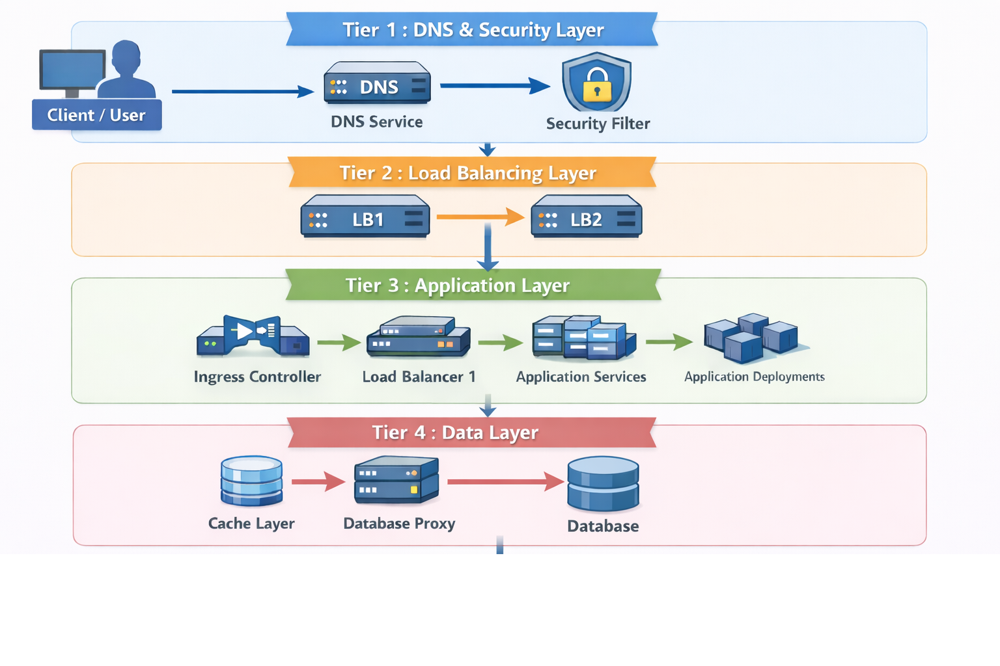

# Nexus - Technical Architecture

## System Overview

Nexus is a Kubernetes-based POS platform deployed on GCP (GKE) with a multi-tier architecture supporting high-availability retail operations. The platform is deployed in Production environment and enables store teams to manage retail operations across 100+ stores, generating 40+ Crores in revenue and serving 500+ store employees daily. The platform uses Application Load Balancer (ALB) deployed separately from GKE, and GKE Ingress controller automatically manages Google Cloud Layer 7 HTTP(S) Load Balancer (GCLB) resources. The GCLB is added as backend in ALB for the Production POS Platform. GKE Ingress handles SSL/TLS termination at the GCE L7 External Load Balancer and forwards traffic to Kubernetes Services with Container Native Load Balancing (direct to pods). Infrastructure is deployed across DEV, SIT, UAT, and PROD environments and is fully operational.

**Note:** Infrastructure deployment and management was handled by DevOps team. Application code was developed by the engineering team.

**Important Notes:**
- **ALB** is an **independent infrastructure component** deployed separately from GKE
- **GKE Ingress** automatically manages Google Cloud L7 External and L7 Internal Load Balancer resources
- **GCLB** is automatically provisioned by GKE Ingress controller and acts as traffic manager
- **Container Native Load Balancing** is configured to forward traffic directly to pods instead of node ports
- **CDN** is not deployed nor needed - services are in same region
- **Cloud SQL Proxy (Layer 7)** enables secure connection from different subnet in same VPC

## Quick Architecture Overview

*4-Tier Architecture Diagram - See [architecture-diagram.mmd](architecture-diagram.mmd) for Mermaid diagram reference*

### Multi-Tier Architecture Summary

**Tier 1: DNS & Security Layer**
- Route53 (AWS) → WAF (Security filtering)
- Traffic Flow: Route53 → WAF

**Tier 2: Load Balancing Layer**
- ALB (separate infrastructure) → GCLB (provisioned by GKE Ingress)
- Traffic Flow: WAF → ALB → GCLB (provisioned by GKE Ingress)

**Tier 3: Application Layer (GKE)**
- Kubernetes Ingress → Kubernetes Services → Kubernetes Deployments
- Kafka (messaging/event streaming)
- Cloud Functions (accessed via service account)
- Traffic Flow: ALB → GCLB → K8s Ingress → K8s Services → K8s Deployments

**Tier 4: Data Layer**
- Redis Cache → Cloud SQL Proxy (Layer 7) → Cloud SQL
- Traffic Flow: Application → Kafka (for messaging) → Redis (for caching) → Cloud SQL Proxy → Cloud SQL

### Complete Data Flow

**Request Flow:**
1. User/Client → Route53 (AWS DNS)
2. Route53 → WAF (Security filtering)
3. WAF → ALB (Application Load Balancer - separate infrastructure)
4. ALB → GCLB (Google Cloud Layer 7 HTTP(S) Load Balancer - provisioned by GKE Ingress)
5. GCLB → Kubernetes Ingress (within GKE cluster)
6. K8s Ingress → K8s Services → K8s Deployments
7. Application → Kafka (for messaging/events) → Redis Cache → Cloud SQL Proxy (Layer 7) → Cloud SQL

**Response Flow:**
1. Cloud SQL/Redis → Application
2. Application → K8s Services → K8s Ingress
3. K8s Ingress → GCLB → ALB → WAF → Route53 → User/Client

### Key Architecture Notes

1. **ALB is NOT deployed by GKE** - It is a separate infrastructure component deployed independently
2. **GKE Ingress automatically manages GCLB** - GKE Ingress controller automatically manages Google Cloud L7 External and L7 Internal Load Balancer resources
3. **GCLB handles SSL/TLS termination** - Incoming L7 TLS connections terminate at the GCE L7 External Load Balancer
4. **Container Native Load Balancing** - Configured to forward traffic directly to pods instead of node ports
5. **GCLB is added as backend in ALB** - Routes traffic to Production POS Platform
6. **Cloud SQL Proxy (Layer 7)** - Enables secure connection from different subnet in same VPC
7. **CDN** - Not deployed nor needed - service generating campaigns is in same region
8. **Hybrid Cloud Architecture** - Route53 (AWS) + ALB/GCLB (GCP) + GKE (GCP)
9. **Clear Separation of Concerns** - Each tier has distinct responsibilities and deployment models

### Infrastructure Deployment Model

**Independent Infrastructure Components:**
- **ALB:** Deployed separately from GKE, managed as standalone infrastructure
- **GCLB:** Automatically managed by GKE Ingress controller, added as backend in ALB for the Production POS Platform
- **Route53:** AWS-managed DNS service
- **WAF:** Separate security layer
- **Cloud SQL:** GCP-managed database service
- **Cloud SQL Proxy:** Layer 7 (Application Layer) proxy for secure database connections from different subnet in same VPC
- **Redis:** Separate caching infrastructure
- **Kafka:** Messaging and event streaming infrastructure

**GKE-Managed Components:**
- **Kubernetes Ingress:** Managed by GKE (Nginx ingress controller)
- **Kubernetes Deployments:** Managed by GKE (all application services)
- **Kubernetes Services:** Managed by GKE (configured with service accounts for Cloud Functions access)
- **kubedns (Kubernetes DNS):** Managed by GKE for internal service discovery and DNS resolution
- **GKE Cluster:** Container orchestration platform

**Serverless Components:**
- **Cloud Functions:** Deployed separately, accessed by Kubernetes services
- **Authentication:** Service account credentials configured in Kubernetes services for secure Cloud Functions invocation

## Architecture Pattern

Nexus follows a **Multi-Tier Architecture** pattern with clear separation of concerns across different layers:

### Tier 1: DNS & Security Layer
- **Route53 (AWS):** DNS service that resolves domain names and routes traffic to WAF
- **WAF (Web Application Firewall):** Standard application firewall rules, positioned after Route53
- **Purpose:** DNS resolution and first line of defense, filtering malicious traffic and enforcing security policies
- **Traffic Flow:** All external traffic flows through Route53 → WAF before reaching load balancers

### Tier 2: Load Balancing Layer
- **Route53 (AWS):** DNS service that resolves domain names and routes traffic to WAF
- **WAF (Web Application Firewall):** Security filtering with standard application firewall rules, positioned after Route53
- **Application Load Balancer (ALB):** HTTP/HTTPS traffic distribution (Layer 7 load balancing)
  - **Deployment Model:** Separate infrastructure component, deployed independently from GKE
  - **Note:** ALB is NOT deployed by GKE - it is managed as standalone infrastructure
  - **Backend Configuration:** GCLB (provisioned by GKE Ingress) is added as backend in ALB pointing to `nexus retail stores`
- **GCLB (Google Cloud Layer 7 HTTP(S) Load Balancer):** Automatically provisioned by GKE Ingress
  - **Purpose:** Acts as traffic manager for Kubernetes Services
  - **Features:** SSL termination, host/path routing, directs traffic to correct pods
  - **Deployment:** Automatically provisioned by GKE Ingress controller
  - **Note:** GCLB is provisioned by GKE Ingress, not a separate deployment
- **Purpose:** DNS resolution, security filtering, traffic distribution, SSL/TLS termination, high availability, and failover
- **Traffic Flow:** Route53 → WAF → ALB → GCLB (provisioned by GKE Ingress) → Kubernetes Services

### Tier 3: Application Layer
- **Kubernetes Ingress (GKE Ingress):** GKE Ingress controller that automatically provisions Google Cloud Layer 7 HTTP(S) Load Balancer (GCLB)
- **Kubernetes Deployments:** Containerized application services (auto-scales based on usage)
  - Single service deployed as Kubernetes deployment
  - **Auto-scaling Pattern:** Pods automatically scale from 1 pod (night) to 6 pods (peak), averaging 3 pods
  - Services communicate via kubedns for service discovery
- **Kubernetes Services:** Service discovery and internal load balancing
  - **Container Native Load Balancing:** Configured to forward traffic directly to pods instead of node ports
  - **Internal Networking:** kubedns handles DNS resolution and service discovery for inter-service communication
- **Traffic Patterns:**
  - **Public Traffic:** External traffic from store employees and retail locations flows through Route53 → WAF → ALB → GCLB → Ingress → Services
  - **Private/Internal Traffic:** Service-to-service communication within cluster and from other internal systems via kubedns → Services
- **Kafka:** Messaging and event streaming for asynchronous communication between services (both public and internal workflows)
- **Cloud Functions:** Serverless functions accessed by Kubernetes services via service account authentication
- **Purpose:** Application logic, business processing, POS operations, retail transaction management
- **Note:** CDN is not deployed nor needed - services are in same region
- **Traffic Flow:** Receives both public and private traffic, processes requests, interacts with messaging (Kafka), caching (Redis), data layer, and Cloud Functions

### Tier 4: Data Layer
- **Cloud SQL:** Primary database (MySQL) with Point-in-Time Recovery and daily backups
- **Redis Cache:** High-performance caching layer (reduces database load by 60-80%)
- **Kafka:** Messaging and event streaming infrastructure
- **Purpose:** Persistent data storage, transaction processing, caching for performance optimization, asynchronous messaging
- **Data Flow:** Application services use Kafka for messaging, query Redis first for caching, then Cloud SQL for persistent data

### Data Flow Through Tiers

**Public Traffic Flow (External Users):**
1. **External Request Flow:**
   - Store Employees/Retail Locations → Route53 (AWS DNS) → WAF (security filtering) → ALB → GCLB (provisioned by GKE Ingress) → K8s Ingress → K8s Services → K8s Deployments

2. **Application Processing:**
   - K8s Deployments → Kafka (for messaging/events) → Redis Cache (check cache) → Cloud SQL (if cache miss or write operation)

3. **Response Flow:**
   - Cloud SQL/Redis → K8s Deployments → K8s Services → K8s Ingress → GCLB → ALB → WAF → Route53 → Store Employees/Retail Locations

**Private/Internal Traffic Flow (Service-to-Service):**
1. **Internal Request Flow:**
   - Internal Services/Other Purplle Systems → kubedns (service discovery) → Kubernetes Services → Kubernetes Deployments
   - Direct service-to-service communication within the cluster via kubedns

2. **Application Processing:**
   - K8s Deployments → Kafka (for messaging/events) → Redis Cache (check cache) → Cloud SQL (if cache miss or write operation)

3. **Response Flow:**
   - Cloud SQL/Redis → K8s Deployments → K8s Services → kubedns → Internal Services/Other Purplle Systems

### Architecture Benefits

- **Enhanced Security:** Multi-layer security with firewall, WAF, and network isolation
- **High Scalability:** Kubernetes auto-scaling (usage-based) and load balancing at multiple levels
- **Performance Optimization:** Redis caching reduces database load by 60-80%
- **Reliability:** Point-in-time recovery, daily backups, and multi-zone deployment
- **Maintainability:** Clear separation of concerns across tiers
- **Cost Efficiency:** Efficient resource utilization through caching and auto-scaling

## Components

### 1. Route53 (AWS)
- **Purpose:** DNS service for domain name resolution and traffic routing
- **Technology:** AWS Route53
- **Responsibilities:**
  - Domain name resolution
  - DNS routing to WAF
  - Health checks and failover
  - First point of entry for all external traffic

### 2. WAF (Web Application Firewall)
- **Purpose:** Security filtering and protection against web exploits
- **Technology:** Web Application Firewall with standard application firewall rules
- **Responsibilities:**
  - Filters malicious traffic and DDoS attacks
  - Enforces security policies
  - Applies standard application firewall rules
  - Positioned after Route53, before ALB

### 3. Application Load Balancer (ALB)
- **Purpose:** HTTP/HTTPS traffic distribution
- **Technology:** GCP Application Load Balancer
- **Deployment:** **Separate infrastructure component, deployed independently from GKE**
- **Note:** ALB is NOT deployed or managed by GKE - it is a standalone infrastructure component
- **Responsibilities:**
  - Layer 7 load balancing
  - HTTP/HTTPS routing to backend services (GCLB)
  - GCLB is added as backend in ALB pointing to `nexus retail stores`

### 4. GCLB (Google Cloud Layer 7 HTTP(S) Load Balancer)
- **Purpose:** Traffic manager automatically managed by GKE Ingress
- **Technology:** Google Cloud Layer 7 HTTP(S) Load Balancer (GCE L7 External Load Balancer)
- **Deployment:** Automatically managed by GKE Ingress controller
- **Responsibilities:**
  - SSL/TLS termination at the GCE L7 External Load Balancer
  - Host/path routing
  - Directing traffic to correct pods via Container Native Load Balancing
  - Exposing internal Kubernetes Services externally
  - Forwards incoming traffic to Kubernetes cluster nodes (or directly to pods with Container Native Load Balancing)
- **Integration:** Added as backend in ALB pointing to `nexus retail stores`
- **Note:** GKE Ingress automatically manages Google Cloud L7 External and L7 Internal Load Balancer resources. The incoming L7 TLS connections terminate at the GCE L7 External Load Balancer, which forwards traffic to the Kubernetes cluster nodes (or directly to pods with Container Native Load Balancing configured)

### 5. Kubernetes Ingress (GKE Ingress)
- **Purpose:** GKE Ingress controller that automatically provisions and manages Google Cloud Layer 7 HTTP(S) Load Balancer (GCLB)
- **Technology:** GKE Ingress Controller
- **Responsibilities:**
  - Automatically manages Google Cloud L7 External and L7 Internal Load Balancer resources
  - Automatically provisions GCLB which acts as traffic manager
  - Handles SSL/TLS termination at the GCE L7 External Load Balancer
  - HTTP/HTTPS routing within cluster
  - Path-based routing
  - Host-based routing
  - Forwards traffic to Kubernetes Services with Container Native Load Balancing (direct to pods)
- **Reference:** [GKE Ingress Documentation](https://cloud.google.com/kubernetes-engine/docs/concepts/ingress)

### 6. Kubernetes Deployments
- **Purpose:** Containerized application services
- **Technology:** Kubernetes (GKE)
- **Responsibilities:**
  - Application service hosting
  - Container orchestration
  - Auto-scaling and self-healing

### 7. Kubernetes Services
- **Purpose:** Service discovery and load balancing
- **Technology:** Kubernetes Service objects
- **Responsibilities:**
  - Internal service discovery
  - Load balancing within cluster
  - Service abstraction
  - **Container Native Load Balancing:** Configured to enable GCE load balancer to forward traffic directly to pods instead of node ports

### 9. Cloud SQL Database
- **Purpose:** Primary database for campaign data, user preferences, and transactions
- **Technology:** Cloud SQL (MySQL)
- **Responsibilities:**
  - Persistent data storage
  - Transaction processing (handles 30 Rs/click rate)
  - Campaign and bidding data management
  - User preference data storage
- **Features:**
  - Point-in-time recovery (PITR) enabled
  - Daily automated backups
  - High availability configuration

### 10. Cloud SQL Proxy
- **Purpose:** Secure connection to Cloud SQL from different subnet in same VPC
- **Technology:** Cloud SQL Proxy (Layer 7 - Application Layer)
- **OSI Layer:** Layer 7 (Application Layer)
- **Deployment:** Deployed in Kubernetes cluster
- **Responsibilities:**
  - Provides secure connection to Cloud SQL database
  - Enables connection from different subnet within same VPC
  - Handles authentication and encryption
  - Manages connection pooling
- **Network Architecture:** Connects Kubernetes pods in one subnet to Cloud SQL in different subnet within same VPC

### 11. Redis Cache
- **Purpose:** High-performance caching layer to reduce database load
- **Technology:** Redis
- **Responsibilities:**
  - Cache frequently accessed transaction data
  - Cache session data
  - Cache configuration data
  - Cache operational data
  - Reduce database query load by 60-80%

### 12. Kafka
- **Purpose:** Messaging and event streaming for asynchronous communication between services
- **Technology:** Apache Kafka
- **Deployment:** Deployed within Kubernetes cluster or as managed service
- **Responsibilities:**
  - Asynchronous messaging between services
  - Event streaming and event-driven architecture
  - Reliable message delivery and processing
  - Decoupling services for better scalability
  - Handling high-throughput message processing

### 13. Cloud Functions
- **Purpose:** Serverless functions for event-driven processing and background tasks
- **Technology:** GCP Cloud Functions
- **Deployment:** Deployed separately, accessed by Kubernetes services
- **Authentication:** Accessed via service account used in Kubernetes services
- **Responsibilities:**
  - Event-driven processing
  - Background task execution
  - Asynchronous operations
  - Integration with other GCP services
- **Access Pattern:** Kubernetes services authenticate to Cloud Functions using service account credentials

## Data Flow

### Request Flow (Inbound)

**Public Traffic Flow (External Users - Store Employees/Retail Locations):**

1. **DNS Resolution:**
   - Store Employees/Retail Locations send request → Route53 (AWS DNS service)
   - Route53 routes traffic for Production POS Platform to WAF endpoint

2. **Security Layer:**
   - Route53 → WAF (Web Application Firewall applies standard firewall rules)
   - WAF filters malicious traffic, DDoS attacks, and enforces security policies

3. **Application Load Balancing:**
   - WAF → ALB (Application Load Balancer for HTTP/HTTPS traffic)
   - ALB has GCLB added as backend for Production POS Platform

4. **GKE Ingress & GCLB:**
   - ALB → GCLB (Google Cloud Layer 7 HTTP(S) Load Balancer)
   - GCLB is automatically provisioned by GKE Ingress controller
   - GCLB acts as traffic manager, handles SSL termination, host/path routing
   - GCLB directs traffic to correct pods

5. **Application Routing:**
   - GCLB → Kubernetes Ingress (GKE Ingress controller)
   - Ingress automatically provisions GCLB and routes based on host, path, and routing rules
   - Ingress scales automatically based on network load

6. **Service Discovery:**
   - K8s Ingress → Kubernetes Services (internal load balancing)
   - kubedns (Kubernetes DNS) resolves service names for inter-service communication
   - Services route to appropriate pods based on service selectors

7. **Application Processing:**
   - K8s Services → Kubernetes Deployments (application pods)
   - Application processes request, executes business logic
   - Deployments auto-scale based on CPU, memory, and custom metrics
   - Application services communicate via kubedns

**Private/Internal Traffic Flow (Service-to-Service):**

1. **Internal Service Discovery:**
   - Internal Services/Other Purplle Systems → kubedns (Kubernetes DNS)
   - kubedns resolves service names for inter-service communication within the cluster
   - Direct service-to-service communication bypassing external load balancers

2. **Service Routing:**
   - kubedns → Kubernetes Services (internal load balancing)
   - Services route to appropriate pods based on service selectors
   - Internal traffic stays within the cluster network

3. **Application Processing:**
   - K8s Services → Kubernetes Deployments (application pods)
   - Application processes internal request, executes business logic
   - Deployments auto-scale based on CPU, memory, and custom metrics
   - Application services communicate via kubedns for internal workflows

7. **Data Access:**
   - Application → Redis Cache (check for cached data)
   - If cache hit: Return data from Redis
   - If cache miss: Application → Cloud SQL Proxy (Layer 7) → Cloud SQL (query database)
   - Cloud SQL Proxy provides secure connection from different subnet in same VPC
   - Cache updated after database query

8. **Messaging & Event Streaming:**
   - Application → Kafka (for asynchronous messaging and event streaming)
   - Kafka handles event-driven communication between services
   - Enables reliable message delivery and processing

9. **Cloud Functions Integration:**
   - Kubernetes Services → Cloud Functions (authenticated via service account)
   - Cloud Functions execute event-driven tasks and background processing
   - Service account credentials used for secure authentication between K8s services and Cloud Functions

### Response Flow (Outbound)

1. **Data Retrieval:**
   - Cloud SQL/Redis → Application (K8s Deployments)

2. **Response Processing:**
   - Application processes data, generates response
   - Application → K8s Services → K8s Ingress

3. **Load Balancing:**
   - K8s Ingress → GCLB (Google Cloud Layer 7 HTTP(S) Load Balancer)
   - GCLB → ALB (Application Load Balancer)

4. **Security & Delivery:**
   - ALB → WAF (Web Application Firewall)
   - WAF → Route53 (AWS DNS)
   - Route53 → User/Client

### POS Transaction Flow

1. Store employee/retail location → Request flows through all tiers
2. Application processes POS transaction → Redis (cache update) → Cloud SQL (persistent storage)
3. Transaction processed across 100+ stores
4. Database handles POS transactions with Redis reducing load by 60-80%
5. Background processing → Kubernetes Services → Cloud Functions (via service account) for async tasks
6. Auto-scaling adjusts pod count based on traffic: 1 pod (night) → 6 pods (peak) → 3 pods (closing)

## Infrastructure Design

### Network Architecture
- **VPC Structure:** Multi-VPC setup for DEV, SIT, UAT, and PROD environments
- **Subnets:** Segregated subnets for different tiers and services
  - **Cloud SQL Proxy:** Enables secure connection from Kubernetes pods in one subnet to Cloud SQL in different subnet within same VPC
- **Internal Service Discovery:** 
  - **kubedns (Kubernetes DNS):** Handles DNS resolution and service discovery for inter-service communication within the Kubernetes cluster
  - All application services communicate via kubedns for service discovery
- **Load Balancing:** 
  - **ALB:** Separate infrastructure component for application traffic (HTTP/HTTPS) - NOT deployed by GKE
  - **GCLB:** Automatically provisioned by GKE Ingress, added as backend in ALB for Production POS Platform
  - **K8s Ingress:** Managed by GKE, automatically provisions GCLB for traffic management
- **CDN:** Not deployed nor needed - services are in same region
- **Deployment Model:** ALB is deployed independently from GKE, GCLB is automatically provisioned by GKE Ingress

### Compute Resources
- **Kubernetes Clusters:** GKE Standard clusters across four environments
  - DEV cluster (Mumbai - asia-south1)
  - SIT cluster
  - UAT cluster
  - PROD cluster (Mumbai - asia-south1)
- **Node Pools:** 
  - **Main Workload Pool:** n2-standard-8 (8 vCPU, 32GB RAM) - ~5-6 high-res pods per VM
  - **Ingress/LB Pool:** n2-standard-4 (4 vCPU, 16GB RAM) - Dedicated Nginx Ingress
- **Auto-scaling:** 
  - Horizontal Pod Autoscaling (HPA) - usage-based scaling
  - Single service with auto-scaling pods (1-6 pods based on demand):
    - **Night time:** 1 pod (low traffic)
    - **Peak time:** 6 pods (high traffic)
    - **Shop closing time:** 3 pods (moderate traffic)
    - **Average:** 3 pods
  - Cluster Autoscaling
  - Node pool autoscaling based on demand
  - Nginx Ingress scales on network load

### Storage & Databases
- **Primary Database:** 
  - Cloud SQL (MySQL) for persistent data storage
  - Handles POS transaction data, retail operations data, and business records
  - **Point-in-Time Recovery (PITR):** Enabled for data recovery to any point in time
  - **Daily Backup:** Automated daily backups for disaster recovery
  - **Transaction Capacity:** Designed to handle high-volume POS transactions
  - **Database Load:** Database handles retail transaction processing and operational queries
- **Caching Layer:** 
  - Redis deployed for high-performance caching
  - Reduces database load by caching:
    - Frequently accessed transaction data
    - Session data
    - Configuration data
    - Operational data
  - Significantly improves response times and reduces database query load
- **Messaging Layer:**
  - Kafka deployed for messaging and event streaming
  - Handles asynchronous communication between services
  - Supports event-driven architecture patterns
  - Enables reliable message delivery and processing
- **Object Storage:** GCS for static assets, logs, and backup storage
- **Backup Strategy:** 
  - Daily automated backups via Cloud SQL
  - Point-in-time recovery capability
  - Backup retention policy configured

### Environment Status
- **DEV:** Development environment for active development and testing
- **SIT:** System Integration Testing environment for integration testing
- **UAT:** User Acceptance Testing environment for user validation
- **PROD:** Production environment fully deployed and live, actively serving production traffic

### Production Status
- **Live & Operational:** Platform is actively being used in Production environment (POS Platform)
- **Software Replacement:** Successfully replaced ₹80 Lakh/year business management software
- **Active Usage:** Currently serving as alternative to expensive third-party solution

## Security Architecture

### Zero Trust Security
- **Zero Trust Architecture:** Implemented zero-trust security model with defense-in-depth approach
- **Defense-in-Depth:** Multiple layers of security controls at network, application, and data levels
- **Least Privilege Access:** Minimal required permissions for services and users
- **Continuous Verification:** Ongoing security monitoring and verification

### Network Security
- **DNS & Entry Point:** Route53 (AWS DNS) is the entry point for all external traffic
- **Web Application Firewall (WAF):** 
  - Traffic flows Route53 → WAF (Web Application Firewall) with standard application firewall rules
  - WAF filters malicious traffic before it reaches ALB
  - WAF provides protection against common web exploits and attacks
  - Content filtering mechanisms in place
- **Firewall Rules:** 
  - Strict firewall rules allowing only ports 80/443 access via WAF
  - Rest of traffic restricted to internal network only
  - Network segmentation via VPC
- **Geo-blocking:** Geo-blocking implemented to restrict access outside India
- **Rate Limiting:** Rate limiting configured to prevent abuse and ensure fair resource usage
- **Bot Protection:** Bot detection and blocking mechanisms to prevent automated attacks and bot calls

### Identity & Access Management
- **IAM:** Identity and Access Management with role-based policies
- **Kubernetes RBAC:** Hardened container security by implementing Kubernetes RBAC, Secure Boot, automated IAM role minimization using Python, and Trivy container scanning integrated with GitLab CI to detect and remediate vulnerable code, adhering to zero-trust architecture and DevSecOps principles
- **Automated IAM Role Minimization:** Automated IAM role minimization using Python scripts to enforce least privilege access across GCP and AWS
- **Secure Boot:** Secure Boot enabled for enhanced security
- **Service Account Authentication:** Service account authentication for Cloud Functions access from Kubernetes services
- **Service Accounts:** Service accounts configured in Kubernetes services for secure Cloud Functions invocation
- **Secrets Manager:** Strengthened microservices security by deploying Secrets Manager across Kubernetes (K8s) clusters and VMs, decoupling sensitive credentials from application source code
- **SSO & IP Whitelisting:** Implemented Single Sign-On (SSO) authentication & IP Whitelisting for multiple internal URLs, centralizing access control and improving security posture
- **Defense-in-Depth:** Implemented defense-in-depth security controls to enforce traffic segmentation and access restrictions, ensuring secure and compliant deployments across environments

### Data Protection & Compliance
- **DPDP Law Compliance:** Compliant with India's Digital Personal Data Protection Act, 2023
  - Data protection and privacy measures aligned with DPDP requirements
  - User data handling in accordance with Indian data protection regulations
  - Privacy-first approach to data collection and processing
- **Secrets Management:** GCP Secrets Manager used for all secrets management
  - API keys and tokens
  - Database credentials
  - Application configuration secrets
  - All sensitive data and credentials
- **SSL/TLS Certificates:** Self-managed SSL certificates
  - Self-managed certificates obtained, provisioned, and renewed independently
  - Used to secure communication between clients and load balancers
  - Supported certificate types: Domain Validation (DV), Organization Validation (OV), Extended Validation (EV)
  - Used with Global external Application Load Balancer and Regional external Application Load Balancer
- **Encryption:** 
  - Encryption in transit: TLS/SSL for all external traffic (ports 80/443)
  - Encryption at rest: Cloud SQL and storage encryption enabled

### Security Best Practices
- **Network Segmentation:** VPC-based network isolation
- **Regular Security Audits:** Ongoing security monitoring and assessment
- **Incident Response:** Prepared incident response procedures
- **Security Monitoring:** Continuous monitoring of security events and anomalies

## Monitoring & Observability

- **Metrics Collection:** 
  - Prometheus deployed in Kubernetes cluster for metrics collection
  - Scrapes metrics from K8s pods, services, and infrastructure components
  - Collects application metrics, infrastructure metrics, and business metrics
- **Visualization:** 
  - Grafana connected to Prometheus as datasource
  - Custom dashboards for real-time monitoring of:
    - Application performance metrics
    - Infrastructure health (CPU, memory, network)
    - Ad serving metrics and click-through rates
    - Database performance metrics
- **Alerting:** 
  - Grafana alerts configured for critical thresholds
  - Alert notifications for:
    - High error rates
    - Resource exhaustion
    - Database connection issues
    - Service downtime
    - Performance degradation
- **Logging:** 
  - GCP Stackdriver (Cloud Logging) for centralized log aggregation
  - Application logs, access logs, and system logs collected
  - Log-based monitoring and analysis
  - Integration with GCP monitoring stack

## Disaster Recovery

- **High-Availability Data Persistence and DR:** Engineered high-availability Data Persistence and Disaster Recovery (DR) solutions for MySQL, MongoDB, and Elasticsearch, utilizing automated backup triggers to ensure system resilience and data integrity

- **Backup Strategy:** 
  - Cloud SQL point-in-time recovery (PITR) enabled
  - Daily automated backups stored in GCS
  - Backup retention policy configured for compliance
  - Automated backup triggers for MySQL, MongoDB, and Elasticsearch
- **DR Plan:** 
  - **Point-in-Time Recovery:** Configured in different subnet/zone for geographic redundancy
  - **Infrastructure as Code (IaC):** Complete infrastructure defined in Terraform/Ansible
  - **DR Environment:** Ready-to-deploy infrastructure code for rapid recovery
  - **Backup Restoration:** Automated restore procedures from daily backups
  - **Multi-Zone Deployment:** Production infrastructure spans multiple availability zones
  - **Failover Capability:** Can quickly spin up infrastructure in different zone using IaC
- **RTO/RPO:** 
  - **Recovery Time Objective (RTO):** [Target: < 1 hour with IaC deployment]
  - **Recovery Point Objective (RPO):** [Target: < 15 minutes with PITR, < 24 hours with daily backups]

## Scalability Considerations

- **Horizontal Scaling:** 
  - **Kubernetes Usage-Based Scaling:** 
    - Horizontal Pod Autoscaler (HPA) configured based on CPU, memory, and custom metrics
    - Pods automatically scale up/down based on actual usage and demand
    - Supports traffic spikes during peak hours and sales events
  - **Nginx Ingress Scaling:** 
    - Nginx ingress controller scales automatically based on network load
    - Handles increased traffic volume during high-demand periods
    - Load distribution across multiple ingress pods
  - **Database Scaling:** 
    - Cloud SQL read replicas for read-heavy workloads
    - Connection pooling to handle concurrent requests
- **Vertical Scaling:** 
  - Cloud SQL instance sizing can be adjusted based on workload
  - Kubernetes node pool scaling for compute resources
  - Redis cluster scaling for cache capacity
- **Performance Optimization:** 
  - **Caching Strategy:** 
    - Redis caching layer reduces database load by 60-80%
    - Frequently accessed data cached (campaigns, user preferences, ad configurations)
    - Cache invalidation strategies for data consistency
  - **Database Optimization:** 
    - Indexed queries for fast data retrieval
    - Connection pooling to manage database connections efficiently
    - Query optimization for high transaction volume (~3.65 Lakh clicks/day, ~1.11 Crore clicks/month)
  - **Load Balancing:** 
    - ALB distributes traffic across multiple backend instances
    - GCLB (provisioned by GKE Ingress) handles traffic routing
    - Kubernetes service load balancing for internal traffic
  - **CDN:** Not deployed nor needed - service generating campaigns is in same region - service generating campaigns is in same region
  - **Network Optimization:** 
    - WAF positioned before ALB for security without performance impact
    - Optimized routing through internal network for backend services
  - **Application-Level Optimization:** 
    - Efficient ad serving algorithms
    - Batch processing for non-critical operations
    - Async processing for background tasks
  - **Monitoring-Driven Optimization:** 
    - Prometheus metrics identify performance bottlenecks
    - Grafana dashboards enable proactive optimization
    - Continuous performance tuning based on real-time metrics

