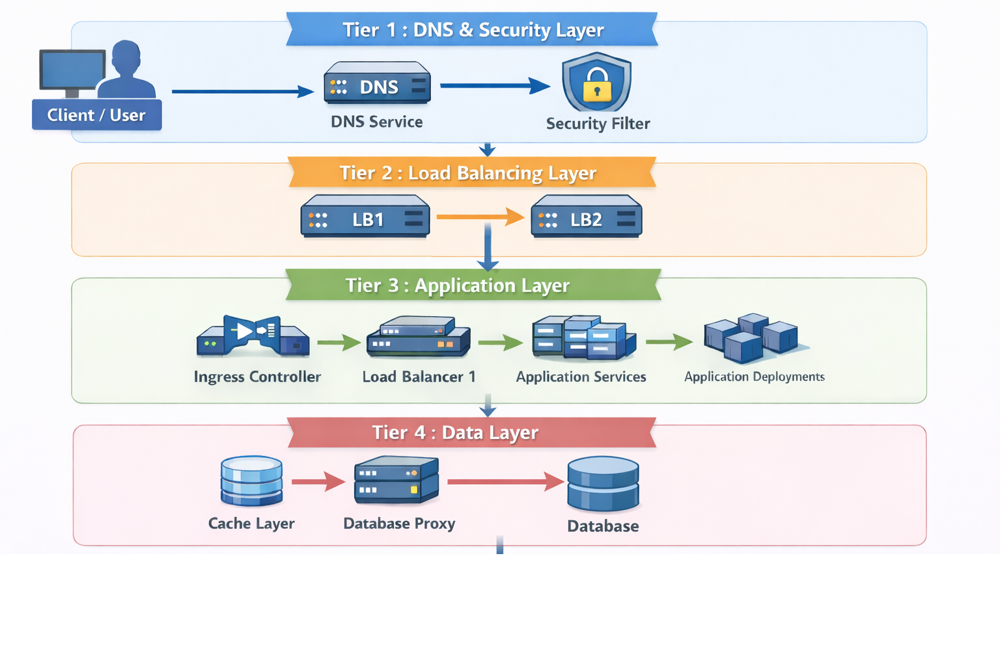

# PurplleAds - AdTech Platform | Purplle.com

## Project Overview

**Company:** Purplle.com 
**Project Type:** Production Platform - In-House AdTech Solution 
**Status:** Live & Operational 
**Duration:** Jul 2025 - Aug 2025 
**Platform:** PurplleAds - Internal Brand Management & Advertising Platform 
**Deployment:** Production Environment (AdTech Platform) 
**Role:** DevOps Engineer | Team Size: 5 people

## Executive Summary

PurplleAds is an in-house brand management platform that enables brands to advertise products on Purplle.com through search widgets and banners. The platform operates on a daily budget and bidding system, leveraging user preference data for optimized ad delivery. Successfully replaced US$96K/year third-party business management software with in-house solution.

## Business Objectives

**Primary Goal:** Build an in-house internal-only brand management software that charges brands for displaying their products in Purplle.com search widgets or banners based on:
- **Daily Budget:** Brands set daily advertising budgets
- **Bidding System:** Brands bid for ad placements
- **User Preference Data:** Leverages existing user preference and behavioral data for targeted ad delivery

**Business Drivers:**
- Manage US$22–25M in annual marketing costs across house brands
- Generate US$90M+ in brand advertising revenue
- Enable self-service platform for brands to manage their own campaigns
- Support 5 major house brands with projected revenue of US$82–96M

## Business Metrics

### Scale & Users
- **Total Users:** 10M+ users
- **Daily Active Users:** 400K+ DAU
- **Traffic Spikes (Major Sales):** 4x traffic spike handling
- **Platform Availability:** 99.9%
- **Annual Clicks:** 133.3 million clicks/year (~365K clicks/day)

### Financial Performance

**Platform Revenue:**
- **Brand Advertising Revenue:** US$90M+
- **Total Marketing Cost Managed:** US$22–25M annually

**House Brand Performance :**
- **Total House Brand Revenue:** US$82–96M (40% of Purplle's operating revenue)
- **Total Marketing Spend:** US$20–24M
- **Average Marketing % of Revenue:** ~24%

**House Brand Breakdown:**

| Brand | Revenue | Marketing Cost | Marketing % |
|-------|----------------|----------------------|-------------|
| Faces Canada | US$29–34M | US$8–9M | ~27% |
| Alps Goodness | US$22–25M | US$4.8–5.4M | ~22% |
| Good Vibes | US$18–20M | US$3.6–4.2M | ~20% |
| NY Bae | US$11–13M | US$2.6–3.4M | ~25% |
| Carmesi | US$2.4–3.6M | US$1.2–1.8M | ~45% |

### Cost Savings & ROI

- **Software Replacement:** Replaced US$96K/year third-party business management software
- **Infrastructure Cost:** US$7K/year (GKE - Mumbai region)
- **Net Annual Savings:** US$89K/year (93% cost reduction)
- **ROI:** Infrastructure cost is only 7.1% of software savings
- **Cost Efficiency:** 
 - ~US$0.00008/user/month
 - ~US$0.00005/click

### Business Model

**Revenue Streams:**
1. Brand Advertising Fees - Brands pay for ad placements
2. Bidding System - Revenue from competitive bidding for premium placements
3. Daily Budget Management - Revenue from brands managing daily advertising spend

**Key Insights:**
- House Brand Revenue Contribution: US$82–96M represents ~40% of Purplle's total operating revenue
- Marketing Efficiency: Average marketing spend is ~24% of revenue across house brands
- Platform manages significant marketing spend (US$20–24M) across 5 major house brands

### Key Achievements

- ✅ **Live Production Platform** - Fully deployed in Production environment, actively serving 10M+ users through AdTech Platform
- ✅ **100+ Production Services** - Managed 100+ high-availability production services on Google Kubernetes Engine (GKE), ensuring optimal performance, scalability, and reliability in production
- ✅ **Cost Optimization** - 93% reduction in software costs (US$96K → US$7K infrastructure). Optimized resource utilization and cost-efficiency by rightsizing GCP/AWS instances and implementing autoscaling policies, achieving a 30% reduction in cloud spend through usage audits and resource cleanup
- ✅ **Scalability** - Handles 4x traffic spikes during major sales events while sustaining 400K+ DAU
- ✅ **Revenue Support** - Platform supports US$90M+ in brand advertising revenue
- ✅ **House Brand Support** - Critical platform for 5 major house brands (US$82–96M revenue)
- ✅ **CI/CD Modernization** - Accelerated infrastructure delivery speed by 40%+ by collaborating on CI/CD automation using Terraform, Jenkins, and GitOps, automating over 40% of provisioning tasks. Modernized CI/CD infrastructure by migrating from freestyle bash jobs to scripted pipeline jobs in Jenkins, integrated with Slack for real-time job failure alerts, improving monitoring and reducing incident response time
- ✅ **Monitoring & Observability** - Reduced Mean Time to Recovery (MTTR) from 30 to 7 minutes by architecting a unified observability stack with Prometheus and Grafana, enabling real-time monitoring and automated incident escalation
- ✅ **Infrastructure Automation** - 40%+ faster deployments through Terraform and CI/CD automation
- ✅ **Data Persistence & DR** - Engineered high-availability Data Persistence and Disaster Recovery (DR) solutions for MySQL, MongoDB, and Elasticsearch, utilizing automated backup triggers to ensure system resilience and data integrity
- ✅ **Elasticsearch Automation** - Engineered agentic AI-based automation for Elasticsearch cluster management using n8n, Terraform, Ansible, and Python, streamlining cluster provisioning and lifecycle management
- ✅ **Security Implementation** - Hardened container security by implementing Kubernetes RBAC, Secure Boot, automated IAM role minimization using Python, and Trivy container scanning integrated with GitLab CI to detect and remediate vulnerable code, adhering to zero-trust architecture and DevSecOps principles. Strengthened microservices security by deploying Secrets Manager across Kubernetes (K8s) clusters and VMs, decoupling sensitive credentials from application source code. Implemented Single Sign-On (SSO) authentication & IP Whitelisting for multiple internal URLs, centralizing access control and improving security posture. Implemented defense-in-depth security controls to enforce traffic segmentation and access restrictions, ensuring secure and compliant deployments across environments
- ✅ **4-Tier Architecture** - Scalable architecture pattern with multi-layer security
- ✅ **Multi-Cloud Infrastructure** - Hybrid cloud architecture (AWS Route53 + GCP GKE)

## Technical Stack

**Cloud & Infrastructure:** GCP (GKE), AWS (Route53), Kubernetes, ALB, GCLB 
**Container Orchestration:** Kubernetes (GKE), K8s Ingress, Deployments, Services 
**Service Discovery:** kubedns (Kubernetes DNS) for internal cluster networking 
**Databases:** Cloud SQL (MySQL), Redis, Cloud SQL Proxy 
**CI/CD:** Jenkins (scripted pipeline jobs with Slack integration), GitLab CI (with automated testing and Trivy security scanning), GitOps workflows 
**Infrastructure as Code:** Terraform (reusable modules), Ansible, GitOps workflows 
**Monitoring:** Prometheus, Grafana, GCP Stackdriver (unified observability stack) 
**Security:** Zero Trust, WAF, Geo-blocking, Rate Limiting, Bot Protection, DPDP Compliance, Kubernetes RBAC, Secure Boot, Automated IAM role minimization (Python), Trivy container scanning (GitLab CI), GCP Secrets Manager, SSO, IP Whitelisting, Defense-in-Depth 
**Authentication & Authorization:** Keycloak (Identity Provider)

## Architecture Overview

*4-Tier Architecture Diagram - See [Architecture Details](architecture.md) for complete technical documentation and [Mermaid Diagram](architecture-diagram.mmd) for diagram source*

## Infrastructure Automation & Deployment

**Infrastructure as Code:**
- Standardized on Terraform for Infrastructure as Code and integrated into GitOps workflows
- Created reusable, parameterized Terraform modules for:
 - GKE clusters with multi-environment support
 - Cloud SQL instances (MySQL) with automated backups
 - VPCs and network configurations
 - Load balancers (ALB, GCLB) with WAF integration
 - Kubernetes deployments and services
- Built Python scripts to automate IAM role management, reducing misconfigurations
- Integrated into GitLab CI and Jenkins pipelines with automated testing
- **Result:** 40%+ faster deployments with consistent infrastructure, automating over 40% of provisioning tasks

**CI/CD Automation:**
- GitLab CI pipelines for automated infrastructure provisioning and application deployments
- Jenkins pipelines integrated with Terraform for infrastructure automation
- Modernized CI/CD infrastructure by migrating from freestyle bash jobs to scripted pipeline jobs in Jenkins
- Integrated Slack for real-time job failure alerts, improving monitoring and reducing incident response time
- Automated testing and validation in CI/CD workflows
- GitOps approach for consistent infrastructure management
- Automated security scanning (Trivy) integrated into GitLab CI deployment pipelines
- **Result:** Accelerated infrastructure delivery speed by 40%+, automating over 40% of provisioning tasks

**Multi-Environment Deployment:**
- Parameterized Terraform modules enabling consistent deployment across environments
- Environment-specific configurations while maintaining infrastructure consistency
- Automated environment provisioning and management
- **Result:** Consistent infrastructure across Production, Pre-Production, and Sandbox environments

## Service Architecture

**Application Services:**
- All application services (e.g., billing service, campaign service, etc.) are deployed as Kubernetes deployments within the GKE cluster
- Services communicate through Kubernetes service discovery and internal networking
- **Internal Networking:** kubedns (Kubernetes DNS) handles service discovery and DNS resolution for inter-service communication within the cluster
- Each service is containerized and managed through Kubernetes orchestration
- Managed 100+ high-availability production services on GKE, ensuring optimal performance, scalability, and reliability in production

**Authentication & Authorization Flow:**
- **Keycloak:** Handles identity verification and authentication for all platform users
- **Sentinel Service:** RBAC (Role-Based Access Control) service deployed on Kubernetes
 - Operates after Keycloak verification completes
 - Manages role-based permissions and access control for platform services
 - Not managed by this project (separate service)
 - Validates user permissions before allowing access to application services
- Automated service account management for secure inter-service communication

**Security Automation:**
- Hardened container security by implementing Kubernetes RBAC, Secure Boot, automated IAM role minimization using Python, and Trivy container scanning integrated with GitLab CI to detect and remediate vulnerable code, adhering to zero-trust architecture and DevSecOps principles
- Strengthened microservices security by deploying Secrets Manager across Kubernetes (K8s) clusters and VMs, decoupling sensitive credentials from application source code
- Implemented Single Sign-On (SSO) authentication & IP Whitelisting for multiple internal URLs, centralizing access control and improving security posture
- Implemented defense-in-depth security controls to enforce traffic segmentation and access restrictions, ensuring secure and compliant deployments across environments
- Zero-trust security principles with automated network logging and public IP cleanup
- WAF rules configured for geo-blocking, rate limiting, and bot protection

## Documentation

For detailed information, see:
- **[Architecture Details](architecture.md)** - Complete technical architecture and infrastructure design
- **[Architecture Diagram](architecture-diagram.mmd)** - Mermaid diagram source for 4-tier architecture
- **[Metrics & Analysis](metrics.md)** - Detailed metrics, cost analysis, and business performance data

---

**Note:** This is a production platform actively serving traffic through the Production AdTech Platform. All metrics and costs are based on actual production deployment.
