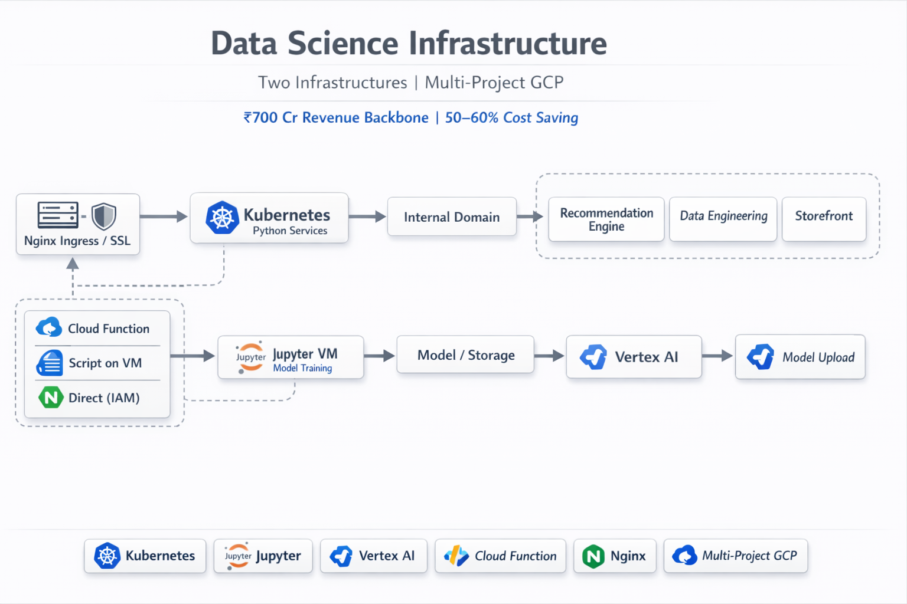

# Data Science Infrastructure | Purplle.com

## Project Overview

**Company:** Purplle.com  
**Project Type:** Production Platform - Data Science / ML Infrastructure (Infrastructure only)  
**Status:** Live & Operational  
**Duration:** Jun 2023 - Feb 2026 
**Platform:** Two infrastructures—(1) distributed Kubernetes-based containerized services (K8s hits Vertex AI for inference), (2) Jupyter VM for training → model uploaded to Vertex AI; multi-project GCP architecture  
**Deployment:** GCP (Kubernetes, Nginx ingress, SSL, internal domain; Jupyter VM, Vertex AI, Cloud Functions; data engineering, data science, and main Purplle app in separate projects)  
**Role:** DevOps / Infrastructure Engineer — managed infrastructure only; did not write application code  
**Note:** Managed the full infrastructure day-to-day: SSL/certifications, Nginx ingress, load balancers, internal domain exposure, Kubernetes cluster, CI/CD, security (IAM, service accounts). Did not write a single piece of application/DS code—only CI/CD and infrastructure code to make the infrastructure run.

## Executive Summary

The **infrastructure/DevOps team** managed **two main infrastructures** for data science and recommendation systems:

### 1. Distributed Kubernetes-based (containerized) infrastructure
- The DS team deployed mainly **Python code as containerized services** on Kubernetes.
- The **DS team manages the embedding pipeline** for the recommendation engine; the **infrastructure team manages the Qdrant vector DB**. **Embeddings are used to power recommendations** (e.g. semantic similarity) consumed by storefront and data engineering.
- **Infra team managed:** SSL/certifications, **Nginx ingress**, load balancers, and **exposing services to internal domain** so other teams can hit them. These are **internal services**—e.g. a **recommendation engine** hits these services; data science workloads run behind them. Other internal teams (data engineering, storefront) call these services to get recommendations or transformed data.

### 2. Jupyter VM (training) and Vertex AI (model destination and inference endpoint)
- **Jupyter on a VM:** Used by the data science team for **training**; **IAM, service accounts, and access** were managed by the DevOps/infra team. Jupyter fetches data, runs training on the VM; the model is stored (e.g. in storage) and then **uploaded to Vertex AI**. **Vertex AI is the end of the training pipeline**—it holds the model and is only called for inference; it does not sit in the middle of the flow.
- **K8s hits Vertex AI:** The **service deployed on Kubernetes** (Python recommendation/DS services) **hits Vertex AI** for inference. Vertex AI only receives those calls and returns the inference output; it does not call anything else. User-facing output can come from **K8s** (which may call Vertex AI), from the **Jupyter VM** (e.g. script or batch output), or via **Cloud Function**.
- **Cloud Function hits K8s first:** In the event-driven flow, the **Cloud Function** triggers and **hits K8s first**; K8s then gets data (and may call Vertex AI for inference). So Cloud Function does not call Vertex AI directly. Triggering of training or jobs: **Cloud Function** (event-driven), **script on the training VM**, or **direct** (IAM, service account).
- **Multi-project architecture:** Data engineering in one GCP project, data science in another, main Purplle application in another. Infra team managed infrastructure across these projects.

### Ownership (infra only)
- **Did not manage** building models or writing application/DS code. Part of the **infrastructure team** that managed this setup day-to-day.
- **Managed infrastructure only;** did not write a single piece of application code. Wrote **CI/CD** and **infrastructure code** so the infrastructure runs.

## Business Impact

### Recommendation backbone for ₹700 Crore revenue
- This infrastructure was the **backbone of the ₹700 Crore revenue system**. The **DS team manages the embedding pipeline**; the **infra team manages the Qdrant vector DB**. **Embeddings are used to deliver recommendations** to users (e.g. search for lipstick → get relevant lipstick, ad placement, other brands’ lipstick products; not unrelated products like face wash). Other brands’ recommendations drove ad revenue for Purplle (similar to the [AdTech platform](https://github.com/thisiskushal31/thisiskushal31/tree/main/projects/6_Adtech.purplle.com_Deployment)).

### Models for internal tasks — 50–60% cost saving
- Models were used for **internal tasks** such as **image tagging for Meta ads, Google Search ads**, and similar work that would otherwise require manual tagging. This **saved 50–60% of the cost** of doing those tasks manually.

## Business Objectives

**Primary Goal:** Provide and operate infrastructure so the DS team could run containerized Python services on Kubernetes (with internal domain exposure for other teams) and run the training/serving flow: Jupyter VM for training → model uploaded to Vertex AI; K8s services hit Vertex AI for inference (Vertex AI is the endpoint at the end; it only gets hit and returns output). CI/CD, security, and multi-project support—without the infra team writing application code.

**Business Requirements:**
- **Kubernetes infrastructure:** Nginx ingress, SSL, load balancers, internal domain so internal teams (recommendation engine, data engineering, storefront) can hit DS services.
- **Jupyter VM and Vertex AI:** IAM, service accounts, VM; Jupyter used for training; model uploaded to Vertex AI (Vertex AI is the model destination and inference endpoint). K8s services hit Vertex AI for inference; Vertex AI only returns output. Triggers: Cloud Function (hits K8s first), script on VM, or direct.
- **Multi-project:** Data engineering, data science, and main Purplle app in separate GCP projects; infra managed across them.
- **CI/CD and security:** Infra team owned CI/CD and security; no application code written by infra.

**Business Drivers:**
- Recommendation and DS outputs power revenue and ads; infra must be reliable and secure.
- Clear split: DS team owns code and models; infra team owns infrastructure, CI/CD, and operations.

## Business Metrics

### Scale & Deployment
- **Two infrastructures:** (1) Kubernetes containerized services (Python), internal domain, Nginx ingress, SSL; K8s hits Vertex AI for inference. (2) Jupyter VM for training → model uploaded to Vertex AI; triggers for training/jobs: Cloud Function (hits K8s first), script on VM, or direct.
- **Multi-project:** Data engineering, data science, main Purplle application in separate GCP projects.
- **Ownership:** Infra team—ingress, SSL, load balancers, internal domain, K8s cluster, CI/CD, IAM/service accounts, VM, Vertex AI (infra side); DS team—application code and models.

### Key Achievements

- ✅ **Distributed Kubernetes infrastructure** — Nginx ingress, SSL, load balancers, internal domain exposure; internal teams (recommendation, data engineering, storefront) can hit DS services.
- ✅ **Jupyter VM and Vertex AI** — Jupyter for training; model uploaded to Vertex AI (Vertex AI is the endpoint at the end). K8s hits Vertex AI for inference; Cloud Function hits K8s first. Triggers: Cloud Function, script on VM, or direct.
- ✅ **Multi-project architecture** — Infra managed across data engineering, data science, and main Purplle projects.
- ✅ **CI/CD and security** — Infra team owned CI/CD and security; no application code written by infra.
- ✅ **Business impact** — Backbone of ₹700 Crore revenue (recommendations); 50–60% cost saving on manual tasks (e.g. image tagging for Meta/Google ads).
- ✅ **Production ready** — Reliable infrastructure so DS and other teams could rely on services and training/serving flow.

## Technical Stack (Infrastructure side)

**Cloud:** GCP, multi-project (data engineering, data science, main app)  
**Kubernetes:** Nginx ingress, SSL/certifications, load balancers, internal domain exposure; Python containerized services (DS team code)  
**Recommendation pipeline:** DS team manages **embedding pipeline**; infra team manages **Qdrant vector DB**; **embeddings power recommendations** consumed by storefront and data engineering  
**Training:** Jupyter VM (model trained, then uploaded to Vertex AI); IAM, service accounts (infra managed)
**Serving:** K8s hits Vertex AI for inference; Vertex AI only returns output
**Event-driven:** Cloud Functions hit K8s first; script on VM or direct for training/job triggers
**CI/CD & security:** Git, pipelines, infra and CI/CD code only; security and access managed by infra team  

## Architecture Overview

*Two infrastructures: (1) Ingress → K8s → Internal domain; K8s hits Vertex AI for inference. (2) Jupyter VM for training → model uploaded to Vertex AI (Vertex AI at the end); Cloud Function hits K8s first; script on VM or direct triggers. See [Architecture Details](architecture.md) and [Architecture Diagram](architecture-diagram.mmd).*

**Infrastructure ownership (platform/DevOps team):**
- **Infra only:** SSL, Nginx ingress, load balancers, internal domain, Kubernetes cluster, CI/CD, IAM/service accounts, Jupyter VM and Vertex AI (infra side). No application or DS code written by infra.
- **DS team:** Application code, models, DAGs; use of VM, Vertex AI, K8s deployments.

## Documentation

- **[Architecture Details](architecture.md)** — Two infrastructures, flow (Jupyter → model → Vertex AI; K8s hits Vertex AI; Cloud Function hits K8s first), multi-project, triggers
- **[Architecture Diagram](architecture-diagram.mmd)** — Mermaid diagram for infra flow
- **[Metrics & Analysis](metrics.md)** — Business impact (₹700 Cr backbone, 50–60% cost save), scale, deployment

---

**Note:** This project describes the **infrastructure** for data science and recommendation platforms. The infra team managed SSL, ingress, load balancers, internal domain, K8s, Jupyter VM, Vertex AI (infra), CI/CD, and security across multiple GCP projects; they did not write application or data science code—only CI/CD and infrastructure code to keep the infrastructure running.
