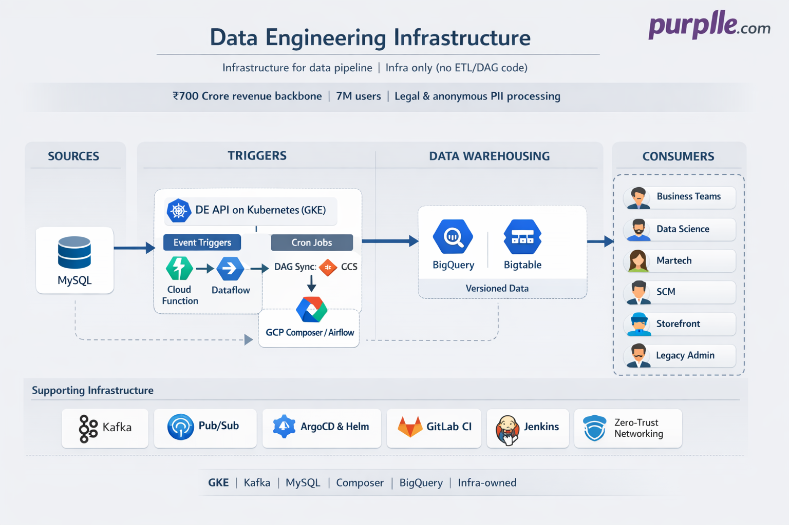

# Data Engineering Infrastructure | Purplle.com

## Project Overview

**Company:** Purplle.com  
**Project Type:** Production Platform - Data Engineering Infrastructure (Infrastructure only)  
**Status:** Live & Operational  
**Platform:** Infrastructure for data engineering pipeline: MySQL → cleanse/transform → data warehousing (BigQuery, BigTable); consumed by business teams, Data Science, Martech, Supply Chain Management, and legacy admin panel.  
**Deployment:** GKE (K8s), ArgoCD, Helm, Terraform, GitLab CI, Jenkins; Kafka, MySQL, Pub/Sub; GCP Composer (Airflow); Cloud Functions; networking, zero-trust.  
**Role:** DevOps / Infrastructure Engineer — managed infrastructure only; did not write ETL, DAGs, data warehousing code, or Kafka contracts.  
**Note:** Managed infrastructure so the Data Engineering team could focus on data warehousing and processing. Infra owned: K8s deployment, CI/CD, Kafka, MySQL, Pub/Sub, DAG sync (Git → GCS → Composer), networking, security. DE team owned: BigQuery, BigTable, ETL logic, DAG logic.

## Executive Summary

Data at Purplle flows from primary databases (MySQL) into a data warehousing solution (BigQuery, BigTable) via extract, transform, and load (ETL) pipelines. The data is versioned and then consumed by **business teams** (analytics, decision support), **Data Engineering** (run and maintain pipelines), **Data Science** (models and analytics), **Martech** (campaigns and admin panel), and **Supply Chain Management** (logistics, procurement, inventory). Business teams and these teams use the warehousing solution for analysis, bulk operations, campaigns, and reporting.

**How data reaches warehousing:** Triggers are either **time-driven** (cron, via GCP Composer/Airflow DAGs) or **event-driven** (e.g. storefront/SCM/Martech/Data Science change → K8s-deployed DE API → Cloud Function → Dataflow → ETL → warehousing). The Data Engineering API and services run on **Kubernetes (GKE)**; infra team deployed and maintained that platform—CI/CD (ArgoCD, Helm, Terraform, GitLab CI, Jenkins), networking, Kafka, MySQL, Pub/Sub, and DAG delivery to Composer. DE team owned BigQuery, BigTable, ETL design, and DAG logic; infra ensured high availability so DE could focus on data warehousing and processing.

**What I managed (summary of facts):**
- **Kubernetes (GKE)** — Deployment, rollouts, and platform for DE services (Java, Go, Scala, Python).
- **CI/CD** — ArgoCD, Helm, Terraform for infra; GitLab CI for CI, Jenkins for CD; DAG sync pipeline (Git/GitLab → GCS bucket → GCP Composer so DAGs show up in Airflow).
- **Kafka** — Managed by infra; DE team did not manage Kafka infrastructure.
- **MySQL** — Primary database (source of data); managed by infra.
- **Pub/Sub** — Managed service; used for messaging.
- **Cloud Functions** — Event-driven workflows; DE team managed function logic; infra managed networking and zero-trust connectivity.
- **Networking & security** — Zero-trust, connectivity between services (e.g. Cloud Function to Dataflow, K8s to warehousing). Flow and access controlled via keyless authentication using service accounts managed with GCP IAM; minimum permissions with custom roles.
- **BigQuery, BigTable, ETL, DAGs** — Owned by DE team; infra did not write ETL or DAG code.

## Business Impact

### ₹700 Crore revenue backbone — data processing for 7M users
- Data engineering pipeline powers the **₹700 Crore revenue backbone**. Data is collected **legally** and processed **anonymously** from **7 million users**; used for business decisions (analytics) and to run **ML models**. Each of the data is treated as **PII data** and handled in a very sensitive way.
- Processed data helps **business leaders** within the organization (CEO-level, business leaders) take decisions—e.g. “This brand is doing great in this region or this age group”—so they can double down on that insight and make more money using the same engine that has been running for years.

### Who uses the data
- Data is used by **business teams** (analytics, decision support) and by **other teams**: Data Science (models, analytics), Martech (campaigns), SCM (logistics, procurement, inventory), storefront (newer data, bulk operations), and **legacy admin panel infrastructure** (see [Legacy Admin Panels Infrastructure](https://github.com/thisiskushal31/thisiskushal31/tree/main/projects/10_Purplle.com_Legacy_Admin_Panels_Infrastructure)), which runs the ₹700 Crore revenue management panel so business teams can run operations from the panel without technical intervention.

## Business Objectives

**Primary Goal:** Maintain infrastructure for the data engineering pipeline so data is cleansed, transformed, and loaded into the data warehousing solution in a reliable way; business teams, Data Science, Martech, and SCM can consume that data for analytics, decision support, models, campaigns, and operations.

**Business Requirements:**
- **Data flow:** MySQL → DE (cleansed, transformed) → data warehousing (loaded) (versioned); consumed by business teams, Data Science, Martech, SCM, and legacy admin panel.
- **Triggers:** Time-driven (cron via Composer/Airflow) or event-driven (e.g. storefront/SCM/Martech change → DE API on K8s → Cloud Function → Dataflow → ETL → warehousing).
- **Infra ownership:** K8s, CI/CD, Kafka, MySQL, Pub/Sub, DAG sync to Composer, networking, security. DE ownership: BigQuery, BigTable, ETL, DAG logic.
- **High availability:** Infra ensures DE team does not have to run infrastructure; they focus on data warehousing and processing.

**Business Drivers:**
- Reliable data pipeline for analytics, campaigns, and supply chain; infra must be stable and secure.
- Clear split: DE team owns data logic and warehousing; infra team owns deployment, platform, and operations.

## Business Metrics

### Scale & Deployment
- **Infra maintained:** GKE (DE services), ArgoCD, Helm, Terraform, GitLab CI, Jenkins; Kafka, MySQL, Pub/Sub; GCP Composer (Airflow); DAG sync (Git → GCS → Composer); Cloud Functions (event-driven); networking, zero-trust.
- **Flow:** Triggers (SCM, storefront, Martech, Data Science) → DE API on K8s → event-driven (Cloud Function → Dataflow → ETL) or cron (Composer DAGs) → data warehousing → consumed by business teams, Data Science, Martech, SCM, storefront, legacy admin panel.
- **Ownership:** Infra—K8s, CI/CD, Kafka, MySQL, Pub/Sub, DAG delivery, networking, security; DE—BigQuery, BigTable, ETL, DAG logic.

### Key Achievements
- ✅ **Infra for DE pipeline** — K8s platform, CI/CD, Kafka, MySQL, Pub/Sub, DAG sync to Composer; DE team could focus on data warehousing and processing.
- ✅ **HA for DE platform** — Managed Kafka, MySQL, and deployment so DE did not have to operate infrastructure.
- ✅ **DAG delivery** — Pipeline (GitLab CI) to sync DAGs from repo to GCS bucket so they appear in GCP Composer/Airflow.
- ✅ **Event and cron paths** — Event-driven (Cloud Function → Dataflow → ETL) and time-driven (Composer DAGs) both supported by infra.
- ✅ **Zero-trust and networking** — Connectivity and security for event-driven workflows and services.

## Technical Stack (Infrastructure side)

**Cloud:** GCP (GKE, Composer, Cloud Functions, Pub/Sub, GCS)  
**Kubernetes:** GKE; DE services (Java, Go, Scala, Python) deployed by infra  
**CI/CD:** ArgoCD, Helm, Terraform; GitLab CI (CI), Jenkins (CD); DAG sync (GitLab CI → GCS → Composer)  
**Data & messaging:** Kafka (infra-managed), MySQL (infra-managed), Pub/Sub (managed); BigQuery, BigTable (DE-managed)  
**Orchestration:** GCP Composer (Airflow) for DAGs; DAGs stored in GCS, synced from Git/GitLab  
**Event-driven:** Cloud Functions; networking and zero-trust by infra  
**ETL:** Dataflow (DE-owned ETL pipelines)  

## Architecture Overview

*Infrastructure for the data engineering pipeline. Triggers → DE API on K8s → event/cron → data warehousing → consumed by business teams, Data Science, Martech, SCM, storefront, legacy admin panel. Infra: K8s, CI/CD, Kafka, MySQL, Pub/Sub, DAG sync, networking, security. See [Architecture Details](architecture.md) and [Architecture Diagram](architecture-diagram.mmd).*

**Infrastructure ownership (platform/DevOps team):**
- **Infra only:** GKE, ArgoCD, Helm, Terraform, GitLab CI, Jenkins, Kafka, MySQL, Pub/Sub, DAG sync to Composer, networking, zero-trust. No ETL or DAG code written by infra.
- **DE team:** BigQuery, BigTable, ETL logic, DAG logic; application code running on K8s.

## Documentation

- **[Architecture Details](architecture.md)** — What I managed (K8s, CI/CD, Kafka, MySQL, Pub/Sub, DAG sync, networking, security); flow (triggers → K8s → event/cron → warehousing); ownership
- **[Architecture Diagram](architecture-diagram.mmd)** — Mermaid diagram for infra and data flow
- **[Metrics & Analysis](metrics.md)** — Scale, deployment, operational metrics

---

**Note:** Managed infrastructure for the data engineering pipeline at Purplle.com. Infra owned K8s, CI/CD, Kafka, MySQL, Pub/Sub, DAG delivery to Composer, networking, and security. Did not write ETL, DAGs, or data warehousing code—only infrastructure and CI/CD so the platform runs. Data Engineering team focused on data warehousing and processing.
