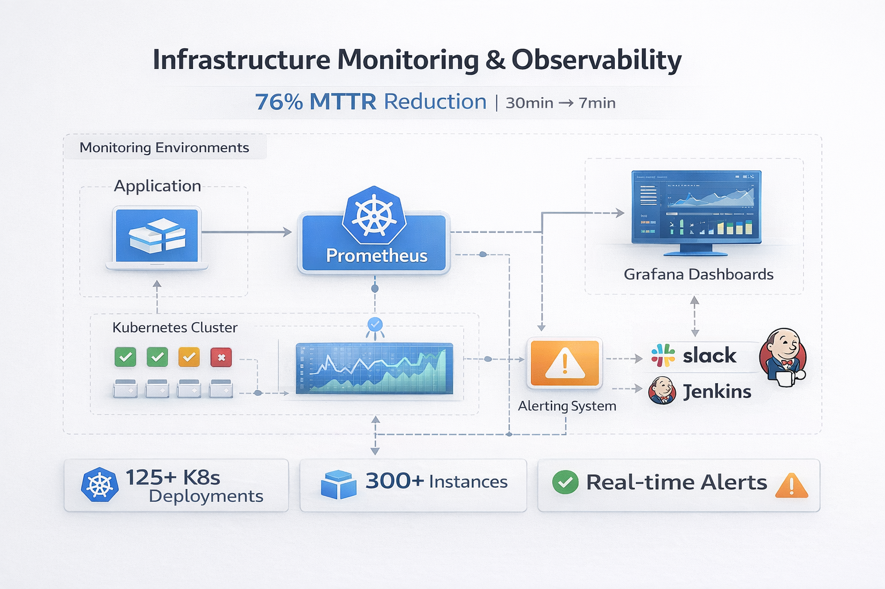
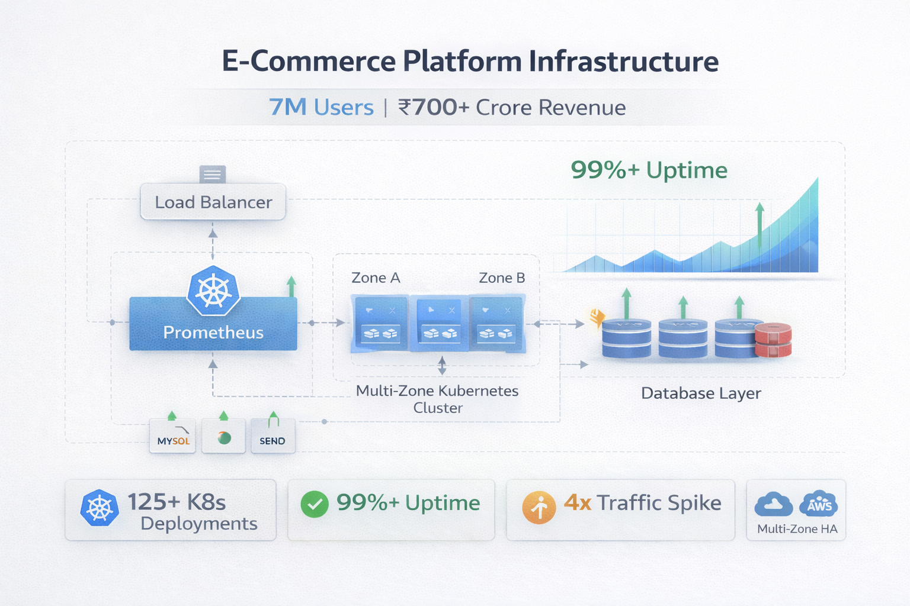
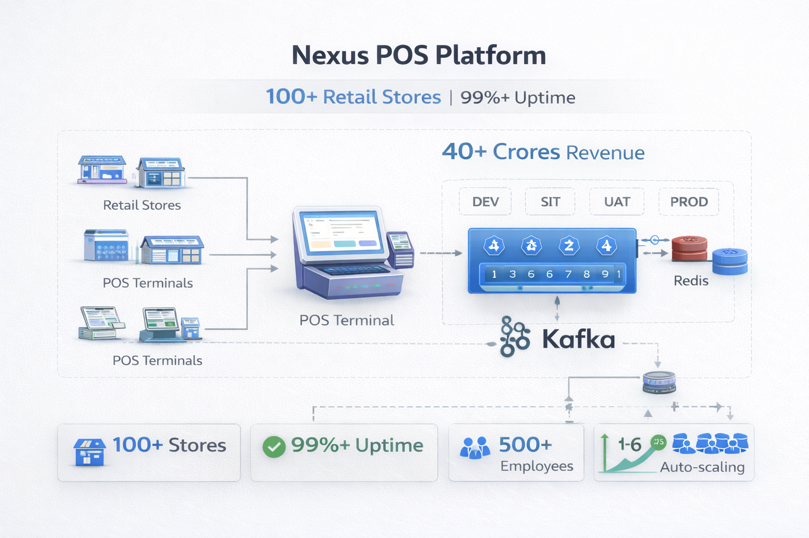
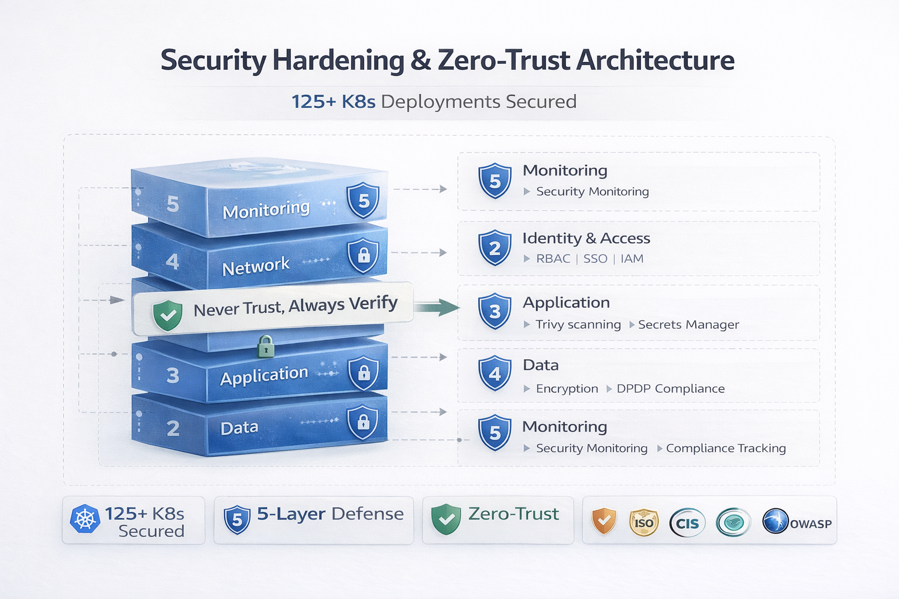
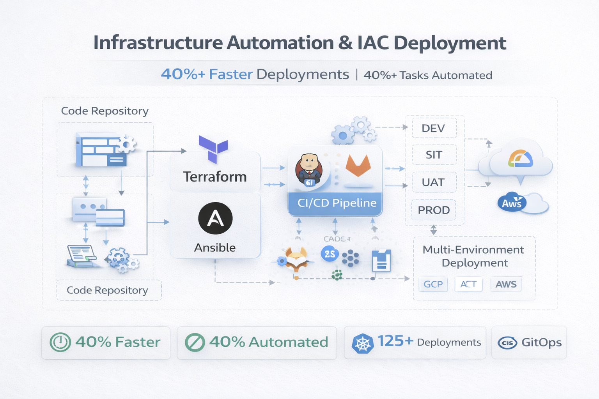
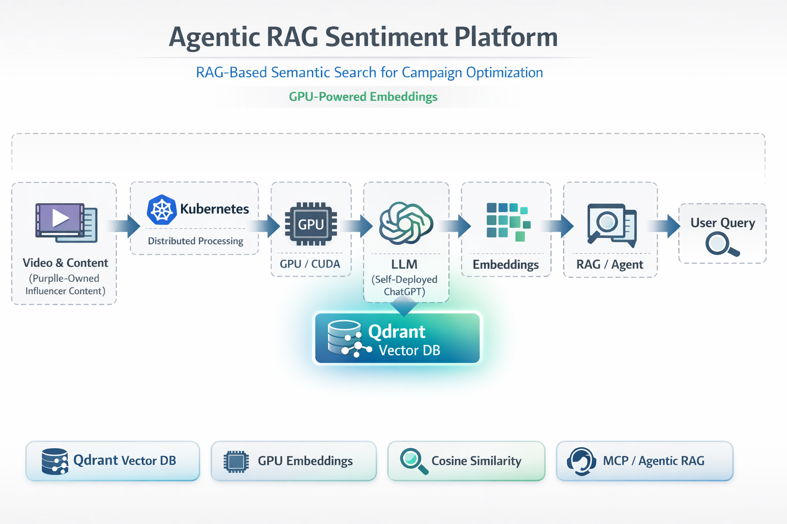

# Overview of Projects

## Overview

This directory contains comprehensive documentation for infrastructure projects demonstrating cloud infrastructure, Kubernetes, Infrastructure as Code, security, monitoring, and multi-cloud deployments across production platforms serving millions of users.

## Projects

#### [PurplleInfra Monitoring Improvement](./1_PurplleInfra_Monitoring_Improvement/)

**Unified Observability Stack** - Prometheus and Grafana implementation  
- **Scale:** 125+ Microservices Distributed Workload, 300+ application instances, 200+ self-managed database instances monitored
- **Infrastructure:** Unified observability stack, real-time monitoring, automated escalation
- **Achievements:** 76% MTTR reduction (30 to 7 minutes), real-time alerting
- **Key Technologies:** Prometheus, Grafana, GCP Stackdriver, Jenkins, Slack
- [View Details →](./1_PurplleInfra_Monitoring_Improvement/)

#### [Purplle.com Management](./2_Purplle.com_Management/)

**Main E-Commerce Platform** - Core e-commerce infrastructure  
- **Scale:** ₹700 Crore annual revenue (as of Jan 1, 2026), 7M total users, 150K DAU (600K during major sales, 300K during minor sales), 300+ application instances, 200+ self-managed database instances, 125+ Microservices Distributed Workload
- **Infrastructure:** 4TB MySQL database, multi-zone deployment, hybrid cloud
- **Achievements:** ₹1 Crore cost savings, 99%+ uptime, zero-lag MySQL migrations (gh-ost)
- **Key Technologies:** Kubernetes, MySQL, Elasticsearch, MongoDB, Redis, Cloud Functions
- [View Details →](./2_Purplle.com_Management/)

#### [Nexus.purplle.com Deployment](./3_Nexus.purplle.com_Deployment/)

**In-House POS Platform** - Point of Sale system for retail stores  
- **Scale:** 100+ retail stores, 500+ daily employees, 40+ Crores revenue
- **Infrastructure:** High-availability deployment across DEV, SIT, UAT, PROD
- **Achievements:** 99%+ uptime, auto-scaling (1-6 pods), multi-environment support
- **Key Technologies:** Kubernetes, Kafka, Redis, Terraform, Jenkins
- [View Details →](./3_Nexus.purplle.com_Deployment/)

#### [Purplle.com Security Improvement](./4_Purplle.com_SecurityImprovement/)

**Security Hardening Initiative** - Comprehensive security improvements  
- **Scale:** 125+ Microservices Distributed Workload, 300+ application instances, 200+ self-managed database instances secured
- **Infrastructure:** Zero-trust architecture, defense-in-depth, multi-layer security
- **Achievements:** Hardened container security, automated IAM minimization, SSO, IP Whitelisting
- **Key Technologies:** Kubernetes RBAC, Secure Boot, Trivy, Secrets Manager, SSO
- **Compliance:** DPDP, ISO 27001/27018/27017/27002 alignment, NIST, CIS, OWASP
- [View Details →](./4_Purplle.com_SecurityImprovement/)

#### [Purplle.com IAC Deployment](./5_Purplle.com_IAC_Deployment/)

**Infrastructure as Code Initiative** - Terraform-based infrastructure automation  
- **Scale:** 125+ Microservices Distributed Workload, 300+ application instances, 200+ self-managed database instances automated
- **Infrastructure:** Multi-environment (DEV, SIT, UAT, PROD), multi-cloud support
- **Achievements:** 40%+ faster deployments, 40%+ provisioning tasks automated
- **Key Technologies:** Terraform, Ansible, Jenkins, GitLab CI, GitOps, Python
- [View Details →](./5_Purplle.com_IAC_Deployment/)

#### [Adtech.purplle.com Deployment](./6_Adtech.purplle.com_Deployment/)

**In-House AdTech Platform** - Brand management and advertising platform  
- **Scale:** 7M total users, 150K DAU (600K during major sales, 300K during minor sales), ₹400+ Crore brand advertising revenue
- **Infrastructure:** 100+ production services, GKE, multi-cloud (AWS + GCP)
- **Achievements:** 93% cost reduction (₹80 Lakh → ₹5.7 Lakh), 4x traffic spike handling during major sales
- **Key Technologies:** Kubernetes, Terraform, GitLab CI, Keycloak
- [View Details →](./6_Adtech.purplle.com_Deployment/)

#### [Agentic RAG Sentiment Platform](./7_Agentic_RAG_Sentiment_Platform/)

**Influencer Content Sentiment Intelligence** - RAG-based semantic search for campaign optimization  
- **Scale:** Purplle-owned influencer video content (YouTube, Instagram); semantic search over configurable time windows (e.g., last 2 days, 7 days)
- **Infrastructure:** Kubernetes, GPU workloads (CUDA), Qdrant vector DB, self-deployed ChatGPT (distributed), MCP/agentic RAG
- **Achievements:** High-availability AI pipeline, CI/CD for embedding and RAG updates, faster decision support for brand teams
- **Key Technologies:** Kubernetes, Qdrant, Python, Docker, CI/CD, cosine similarity, metadata filters, MCP
- [View Details →](./7_Agentic_RAG_Sentiment_Platform/)

#### [Grid Platform - OSS Project](./8_GridPlatform_OSS_Project/)

**AI-First Infrastructure Management Platform** - Open-source infrastructure automation  
- **Scale:** Open-source platform for infrastructure management
- **Infrastructure:** AI-powered automation, multi-cloud support, Infrastructure as Code
- **Achievements:** 60-80% cost reduction, days to minutes setup time, vendor lock-in elimination
- **Key Technologies:** Node.js, TypeScript, React, Terraform, OpenTofu, Ansible, Kubernetes, Docker, GitOps
- **GitHub:** https://github.com/gridplatform
- **Demo:** https://gridplatform.org

## Project Statistics

### Overall Infrastructure Scale
- **Total Microservices Distributed Workload:** 125+ microservices distributed workloads orchestrated
- **Total Database Instances:** 200+ self-managed database instances
- **Total Application Instances:** 300+ instances across infrastructure
- **Production Platforms:** 3 major platforms (plus 1 OSS project)
- **Environments:** 4 environments (DEV, SIT, UAT, PROD)
- **User Base:** 7M total users, 150K DAU (600K during major sales, 300K during minor sales)
- **Database Size:** 4TB MySQL primary database

### Key Achievements Across Projects
- ✅ **40%+ Faster Deployments** - Infrastructure automation and CI/CD modernization
- ✅ **76% MTTR Reduction** - Monitoring improvements (30 to 7 minutes)
- ✅ **₹1 Crore Cost Savings** - Infrastructure optimization and automation
- ✅ **99%+ Uptime** - High availability across all production platforms
- ✅ **100% Infrastructure Automation** - Terraform-based IAC deployment
- ✅ **Comprehensive Security** - Zero-trust architecture, defense-in-depth
- ✅ **Multi-Cloud Architecture** - AWS + GCP hybrid cloud deployment

## Technology Stack

### Cloud & Infrastructure
- **Cloud Platforms:** GCP (GKE, Cloud SQL, VPC, Load Balancer), AWS (Route53)
- **Container Orchestration:** Kubernetes (GKE), 125+ Microservices Distributed Workload
- **Infrastructure as Code:** Terraform, Ansible
- **CI/CD:** Jenkins, GitLab CI, GitOps workflows

### Databases & Storage
- **Relational:** MySQL, Cloud SQL
- **NoSQL:** MongoDB, Elasticsearch, Aerospike
- **Vector DB:** Qdrant (semantic search, cosine similarity, metadata filters)
- **Caching:** Redis, Memorystore
- **Messaging:** Kafka

### AI/ML Infrastructure (RAG Sentiment Platform)
- **Compute:** GPU workloads (CUDA), Kubernetes-based distributed embedding pipeline
- **Vector Search:** Qdrant, cosine similarity, hash-based indexing
- **Orchestration:** MCP, agentic RAG, self-deployed LLM (no persistent deployment)

### Security & Compliance
- **Container Security:** Kubernetes RBAC, Secure Boot, Trivy scanning
- **Access Control:** SSO, IP Whitelisting, automated IAM minimization
- **Secrets Management:** GCP Secrets Manager
- **Compliance:** DPDP, ISO 27001/27018/27017/27002, NIST, CIS, OWASP

### Monitoring & Observability
- **Metrics:** Prometheus
- **Visualization:** Grafana
- **Cloud Monitoring:** GCP Stackdriver
- **Alerting:** Slack integration, automated escalation

## Project Documentation Structure

Each project follows a consistent documentation structure:

- **README.md** - Project overview, business objectives, key achievements, technical stack
- **architecture.md** - Complete technical architecture, implementation details, design decisions
- **metrics.md** - Quantifiable metrics, performance data, before/after comparisons
- **architecture-diagram.mmd** - Mermaid diagram source for architecture visualization

## Quick Navigation

| Project | Type | Key Metric | Status |
|---------|------|------------|--------|
| [Monitoring Improvement](./1_PurplleInfra_Monitoring_Improvement/) | Observability | 76% MTTR reduction | ✅ Implemented |
| [Purplle.com Management](./2_Purplle.com_Management/) | E-Commerce Platform | 7M total, 150K DAU | ✅ Live |
| [Nexus.purplle.com](./3_Nexus.purplle.com_Deployment/) | POS Platform | 100+ stores | ✅ Live |
| [Security Improvement](./4_Purplle.com_SecurityImprovement/) | Security Hardening | 125+ Microservices Distributed Workload | ✅ Implemented |
| [IAC Deployment](./5_Purplle.com_IAC_Deployment/) | Infrastructure Automation | 40%+ faster | ✅ Implemented |
| [Adtech.purplle.com](./6_Adtech.purplle.com_Deployment/) | AdTech Platform | ₹400+ Cr revenue | ✅ Live |
| [RAG Sentiment Platform](./7_Agentic_RAG_Sentiment_Platform/) | AI/ML Infrastructure | Agentic RAG, Qdrant, GPU | ✅ Live |
| [Grid Platform](./8_GridPlatform_OSS_Project/) | OSS Platform | AI-first automation | 🚧 Active Development |

## Project Implementation Details

**Infrastructure Scope:**
- Multi-cloud deployment (GCP + AWS)
- Multi-environment support (DEV, SIT, UAT, PROD)
- Production platforms serving millions of users
- High-availability infrastructure with 99%+ uptime

**Implementation Approach:**
- Infrastructure as Code (Terraform, Ansible) for automation
- Kubernetes orchestration for containerized workloads
- CI/CD pipelines for automated deployments
- Security hardening with zero-trust architecture
- Unified observability stack for monitoring
- Multi-cloud architecture for resilience

## Usage

This portfolio is designed for:
- **Technical Interviews** - Demonstrate infrastructure expertise and impact
- **Client Showcases** - Share relevant projects for specific opportunities
- **Employer Reviews** - Showcase technical capabilities and achievements
- **Technical Discussions** - Reference during architecture and design discussions

---

**Note:** All projects documented here are based on actual production deployments and implementations. All metrics and achievements are based on actual production data. Projects may be from different companies and organizations.
