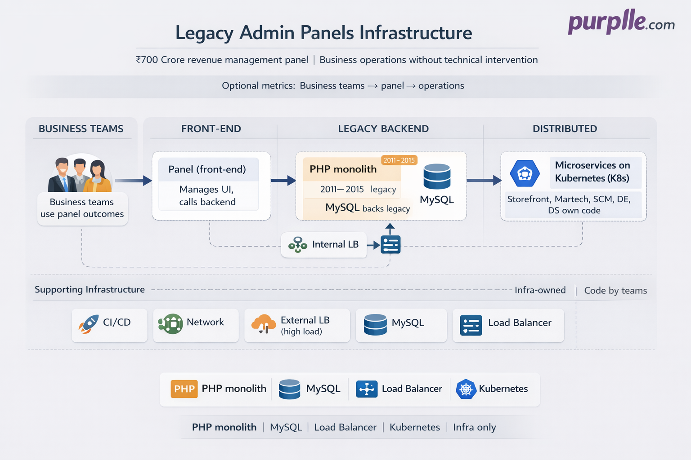
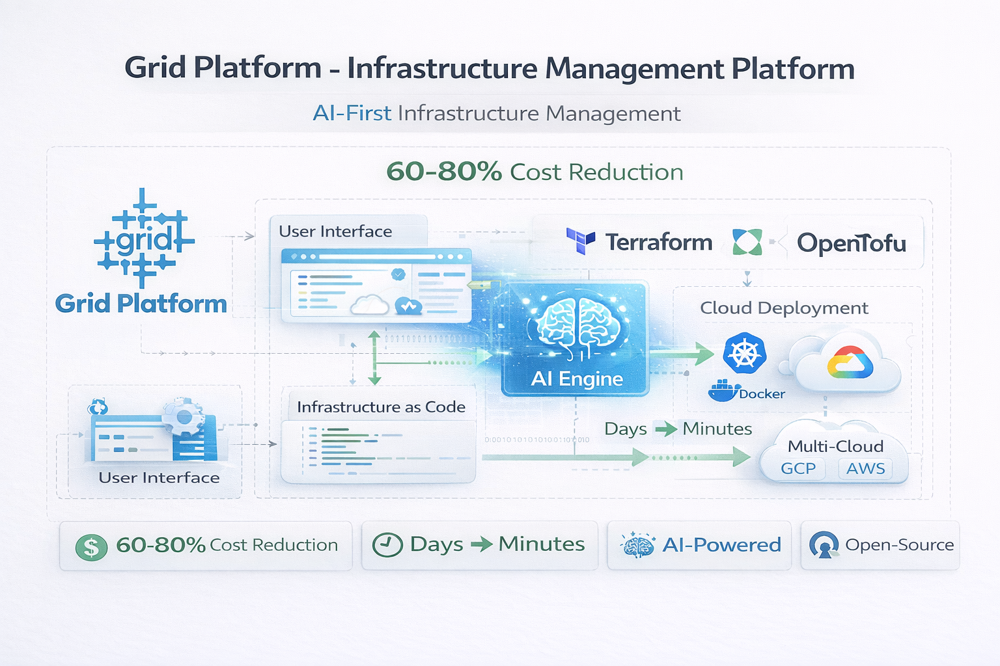

# Projects

This directory holds **one README per project**. Each project has its own scale, tech stack, metrics, and implementation details in its folder. Below is the list of projects; scroll for more. For full details on any project, open its folder and read its README, `architecture.md`, and `metrics.md`.

## Project list

#### [Stealth Startup Infrastructure Deployment & Software Compliance](./11_StealthStartup_Infrastructure_Deployment/)

**AI-Powered CI/CD SaaS** - GitHub App → control/orchestration plane → ephemeral GCP runners; SOC 2–aligned compliance  
- **Architecture:** Customer GitHub Org → platform control layer (runner provisioning, AI RCA, caching, compliance scanning) → ephemeral Compute Engine runners (C4D, us-central1)  
- **GCP:** GKE (stateful + stateless), PostgreSQL, Vertex AI; Silicon → Dev → Staging → Prod; BYOC planned (customer data plane)  
- **Messaging & cache:** NATS JetStream (runners/capacity/auth); Pub/Sub (ad hoc triggers); MicroCeph (CI caching)  
- **Scale:** 15+ production services, 100+ CI jobs/day; ~30 VM types; frequent 32 vCPU / 128 GB runners  
- **Achievements:** Up to 80% faster CI (MicroCeph), full IaC + Atlantis + Argo CD, inventory/cost audit (Slack), SOC 2 + ISO 27001–aligned, semver RC→prod (runners not versioned)  
- **Key Technologies:** GCP, GKE, Compute Engine, PostgreSQL, NATS JetStream, Pub/Sub, MicroCeph, Vertex AI, Terraform, Atlantis, Helm, Argo CD, OpenTelemetry  
- [View Details →](./11_StealthStartup_Infrastructure_Deployment/)

#### [Purplle.com Management](./1_Purplle.com_Management/)

**Main E-Commerce Platform** - Core e-commerce infrastructure 
- **Scale:** US$160M+ annual revenue, 10M+ users, 400K+ DAU (4× traffic spikes during major sales), 300+ application instances, 200+ self-managed database instances, 125+ Microservices Distributed Workload
- **Infrastructure:** 4TB MySQL database, multi-zone deployment, hybrid cloud
- **Achievements:** US$120K+ cost savings, 99.9% availability, zero-lag MySQL migrations (gh-ost)
- **Key Technologies:** Kubernetes, MySQL, Elasticsearch, MongoDB, Redis, Cloud Functions
- [View Details →](./1_Purplle.com_Management/)

#### [Purplle.com Agentic RAG Sentiment Platform](./2_Purplle.com_Agentic_RAG_Sentiment_Platform/)

**Influencer Content Sentiment Intelligence** - RAG-based semantic search for campaign optimization 
- **Scale:** Purplle-owned influencer video content (YouTube, Instagram); semantic search over configurable time windows (e.g., last 2 days, 7 days)
- **Infrastructure:** Kubernetes, GPU workloads (CUDA), Qdrant vector DB, self-deployed ChatGPT (distributed), MCP/agentic RAG
- **Achievements:** High-availability AI pipeline, CI/CD for embedding and RAG updates, faster decision support for brand teams
- **Key Technologies:** Kubernetes, Qdrant, Python, Docker, CI/CD, cosine similarity, metadata filters, MCP
- [View Details →](./2_Purplle.com_Agentic_RAG_Sentiment_Platform/)

#### [Purplle.com Data Science Infrastructure](./3_Purplle.com_Data_Science_Infrastructure/)

**Data Science Infrastructure (full infra)** - Distributed containerized architecture, Nginx ingress, K8s cluster, deployment, internal domain exposure, CI/CD, security; infra for Composer, Jupyter/VMs, Vertex AI, Qdrant 
- **Scale:** Nginx ingress → K8s cluster → deployment → internal domain; Git → VM, Composer; infra for Qdrant, Vertex AI, Airflow (Composer), training VMs (Jupyter)
- **Infrastructure:** Ingress, cluster, deployment, internal domains; CI/CD (Git → VM, Composer); security; did not manage DS code
- **Achievements:** Full project infra ownership; internal domain exposure; infra for Composer, VMs, Vertex AI, Qdrant
- **Key Technologies:** Kubernetes, Nginx Ingress, Qdrant, Vertex AI, Airflow, GCP Composer, Jupyter, CI/CD, Git, GCP, Docker
- [View Details →](./3_Purplle.com_Data_Science_Infrastructure/)

#### [Purplle.com Data Engineering Infrastructure](./4_Purplle.com_Data_Engineering_Infrastructure/)

**Data Engineering Infrastructure (infra only)** - K8s, CI/CD, Kafka, MySQL, Pub/Sub, DAG sync to Composer; DE team focused on data warehousing and processing. 
- **Scale:** Infra for DE pipeline: MySQL → transform → BigQuery/BigTable; consumed by Data Science, Martech, SCM
- **Infrastructure:** GKE, ArgoCD, Helm, Terraform, GitLab CI, Jenkins; Kafka, MySQL, Pub/Sub; Composer (Airflow); networking, zero-trust
- **Achievements:** HA for DE platform; infra so DE team could focus on data warehousing and processing
- **Key Technologies:** Kubernetes, Terraform, ArgoCD, Helm, GitLab CI, Jenkins, Kafka, MySQL, Pub/Sub, GCP Composer, Cloud Functions
- [View Details →](./4_Purplle.com_Data_Engineering_Infrastructure/)

#### [Purplle.com Adtech Deployment](./5_Purplle.com_Adtech_Deployment/)

**In-House AdTech Platform** - Brand management and advertising platform 
- **Scale:** 10M+ users, 400K+ DAU (4× traffic spikes during major sales), US$90M+ brand advertising revenue
- **Infrastructure:** 100+ production services, GKE, multi-cloud (AWS + GCP)
- **Achievements:** 93% cost reduction (US$96K → US$7K), 4x traffic spike handling during major sales
- **Key Technologies:** Kubernetes, Terraform, GitLab CI, Keycloak
- [View Details →](./5_Purplle.com_Adtech_Deployment/)

#### [PurplleNexus Deployment (POS)](./6_PurplleNexus_Deployment/)

**In-House POS Platform** - Point of Sale system for retail stores 
- **Scale:** 200+ retail stores, 500+ daily employees, US$5M+ revenue
- **Infrastructure:** High-availability deployment across DEV, SIT, UAT, PROD
- **Achievements:** 99%+ uptime, auto-scaling (1-6 pods), multi-environment support
- **Key Technologies:** Kubernetes, Kafka, Redis, Terraform, Jenkins
- [View Details →](./6_PurplleNexus_Deployment/)

#### [PurplleInfra Monitoring Improvement](./7_PurplleInfra_Monitoring_Improvement/)

**Unified Observability Stack** - Prometheus and Grafana implementation 
- **Scale:** 125+ Microservices Distributed Workload, 300+ application instances, 200+ self-managed database instances monitored
- **Infrastructure:** Unified observability stack, real-time monitoring, automated escalation
- **Achievements:** 76% MTTR reduction (30 to 7 minutes), real-time alerting
- **Key Technologies:** Prometheus, Grafana, GCP Stackdriver, Jenkins, Slack
- [View Details →](./7_PurplleInfra_Monitoring_Improvement/)

#### [Purplle.com IAC Deployment](./8_Purplle.com_IAC_Deployment/)

**Infrastructure as Code Initiative** - Terraform-based infrastructure automation 
- **Scale:** 125+ Microservices Distributed Workload, 300+ application instances, 200+ self-managed database instances automated
- **Infrastructure:** Multi-environment (DEV, SIT, UAT, PROD), multi-cloud support
- **Achievements:** 40%+ faster deployments, 40%+ provisioning tasks automated
- **Key Technologies:** Terraform, Ansible, Jenkins, GitLab CI, GitOps, Python
- [View Details →](./8_Purplle.com_IAC_Deployment/)

#### [Purplle.com Security Improvement](./9_Purplle.com_SecurityImprovement/)

**Security Hardening Initiative** - Comprehensive security improvements 
- **Scale:** 125+ Microservices Distributed Workload, 300+ application instances, 200+ self-managed database instances secured
- **Infrastructure:** Zero-trust architecture, defense-in-depth, multi-layer security
- **Achievements:** Hardened container security, automated IAM minimization, SSO, IP Whitelisting
- **Key Technologies:** Kubernetes RBAC, Secure Boot, Trivy, Secrets Manager, SSO
- **Compliance:** DPDP, ISO 27001/27018/27017/27002 alignment, NIST, CIS, OWASP
- [View Details →](./9_Purplle.com_SecurityImprovement/)

#### [Purplle.com Legacy Admin Panels Infrastructure](./10_Purplle.com_Legacy_Admin_Panels_Infrastructure/)

**Legacy Backend Admin Panels (infra only)** - Managed system for business teams: front banner, campaigns, Martech, logistics. PHP monolith (front-end maintained) calls distributed K8s via internal load balancer. 
- **Scale:** Legacy PHP monolith + distributed microservices (K8s); MySQL backs legacy; internal LB legacy → K8s
- **Infrastructure:** CI/CD, network, monolith deployment, load balancer (high load), MySQL, internal load balancer
- **Achievements:** Infra for legacy admin panels; load balancer under high load; legacy–distributed path via internal LB
- **Key Technologies:** PHP (legacy), Kubernetes, MySQL, Load balancer, CI/CD
- [View Details →](./10_Purplle.com_Legacy_Admin_Panels_Infrastructure/)

#### [Grid Platform - OSS Project](./12_GridPlatform_OSS_Project/)

**AI-First Infrastructure Management Platform** - Open-source infrastructure automation 
- **Scale:** Open-source platform for infrastructure management
- **Infrastructure:** AI-powered automation, multi-cloud support, Infrastructure as Code
- **Achievements:** 60-80% cost reduction, days to minutes setup time, vendor lock-in elimination
- **Key Technologies:** Node.js, TypeScript, React, Terraform, OpenTofu, Ansible, Kubernetes, Docker, GitOps
- **GitHub:** https://github.com/gridplatform
- **Demo:** https://gridplatform.org

## How to read this page

Each project above is self-contained: **scale, tech stack, achievements, and implementation details** live in that project's README, `architecture.md`, and `metrics.md`. Scroll through the project cards for an overview; open a project folder for full details. Nothing in this README duplicates project-specific numbers or stacks, so adding or changing projects doesn't require updating this file.

## Project documentation structure

Each project follows a consistent documentation structure:

- **README.md** - Project overview, business objectives, key achievements, technical stack
- **architecture.md** - Complete technical architecture, implementation details, design decisions
- **metrics.md** - Quantifiable metrics, performance data, before/after comparisons
- **architecture-diagram.mmd** - Mermaid diagram source for architecture visualization

## Quick navigation

| Project | Type | Key metric | Status |
|---------|------|------------|--------|
| [Stealth Startup Infra & Compliance](./11_StealthStartup_Infrastructure_Deployment/) | CI/CD SaaS Platform | 80% faster CI · SOC 2 + ISO 27001 | ✅ Live (current) |
| [Purplle.com Management](./1_Purplle.com_Management/) | E-Commerce Platform | 10M+ users, 400K+ DAU | ✅ Live |
| [Purplle.com RAG Sentiment Platform](./2_Purplle.com_Agentic_RAG_Sentiment_Platform/) | AI/ML Infrastructure | Agentic RAG, Qdrant, GPU | ✅ Live |
| [Purplle.com Data Science Infrastructure](./3_Purplle.com_Data_Science_Infrastructure/) | DS/ML Infra | Ingress, K8s, Composer, Vertex AI, Qdrant | ✅ Live |
| [Purplle.com Data Engineering Infrastructure](./4_Purplle.com_Data_Engineering_Infrastructure/) | DE Infra | K8s, CI/CD, Kafka, Composer; infra only | ✅ Live |
| [Purplle.com Adtech](./5_Purplle.com_Adtech_Deployment/) | AdTech Platform | US$90M+ revenue | ✅ Live |
| [PurplleNexus (POS)](./6_PurplleNexus_Deployment/) | POS Platform | 200+ stores | ✅ Live |
| [Monitoring Improvement](./7_PurplleInfra_Monitoring_Improvement/) | Observability | 76% MTTR reduction | ✅ Implemented |
| [IAC Deployment](./8_Purplle.com_IAC_Deployment/) | Infrastructure Automation | 40%+ faster | ✅ Implemented |
| [Security Improvement](./9_Purplle.com_SecurityImprovement/) | Security Hardening | 125+ Microservices Distributed Workload | ✅ Implemented |
| [Purplle.com Legacy Admin Panels](./10_Purplle.com_Legacy_Admin_Panels_Infrastructure/) | Legacy Admin | PHP monolith + internal LB to K8s; infra only | ✅ Live |
| [Grid Platform](./12_GridPlatform_OSS_Project/) | OSS Platform | AI-first automation | 🚧 Active Development |

## Usage

This portfolio is designed for:
- **Technical Interviews** - Demonstrate infrastructure expertise and impact
- **Client Showcases** - Share relevant projects for specific opportunities
- **Employer Reviews** - Showcase technical capabilities and achievements
- **Technical Discussions** - Reference during architecture and design discussions

---

**Note:** All projects documented here are based on actual production deployments and implementations. All metrics and achievements are based on actual production data. Projects may be from different companies and organizations.
